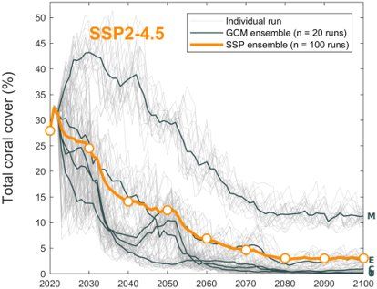
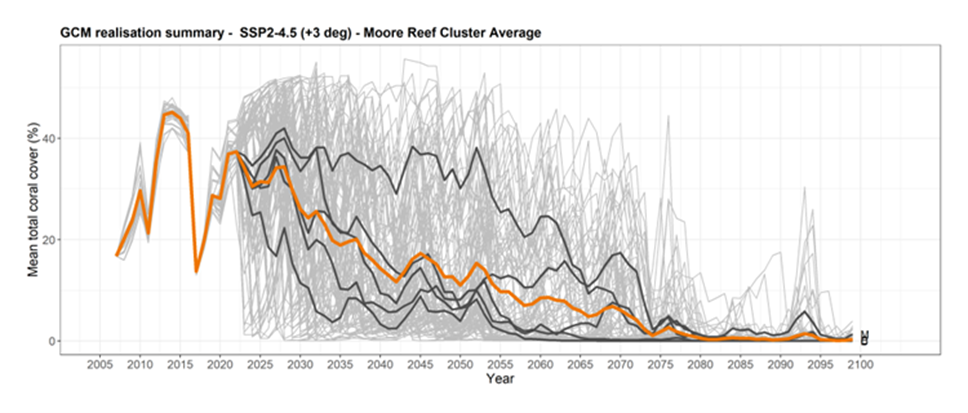
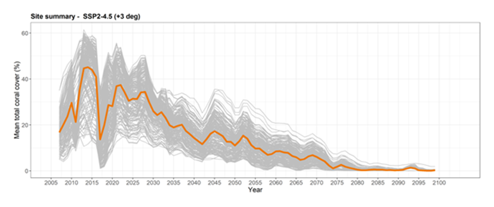

# Counterfactual Modelling

Counterfactuals are defined as the no-RRAP cases. Specifically, they are the expected trajectories of environmental, ecological, social and economic performance metrics of system state in the absence of RRAP interventions under different climate-change scenarios. Effective counterfactuals for RRAP should represent best cases for conventional management and provide the basis for predicting the impacts of RRAP interventions (including performance, and consequences of net benefits and values). Detailed information on the knowledge, processes, systems, and decisions used to produce counterfactuals for RRAP can be found in the MDS 2021 Counterfactual Report (Adaptus et al., 2022a).

The objectives for counterfactual modelling are (non-exhaustive) to:

1. Provide baseline projections by which to assess the efficacy and value from intervention deployment, informed by estimations of possible long-term scenarios of ecological condition of the GBR at relevant scales (within-reef, reef-scale and GBR wide) and consequent ecosystem services and socio-economic values given:
    - climate change,
    - chemical (e.g., ocean acidification) and ecological (e.g., genetic adaptation) process responses to climate change,
    - predict temporal changes to other ecological processes,
    - predict temporal changes to biological (e.g., COTS) and environmental conditions (e.g., water quality, cyclones), and
    - effects of conventional GBR management approaches (e.g., water quality improvement, COTS control).
1. Contribute to the provision of increased certainty to decision makers on the likelihood of preferred interventions delivering positive net benefits (value from intervention minus cost of deployment), given uncertainty in long-term ecological condition (from uncertainty in each of the above considerations.)

The MDS suite delivers counterfactual modelling using three ecological models: CoCoNet, ReefMod and C~scape. 

[**CoCoNet**](/rrap-mds-knowledge-hub/modelling/coconet/ "CoCoNet Model"){:target="\_blank"}

[**Reefmod**](/rrap-mds-knowledge-hub/modelling/reefmod/ "Reefmod Model"){:target="\_blank"}

[**C~scape**](/rrap-mds-knowledge-hub/modelling/c-scape/ "C~scape Model"){:target="\_blank"}

[**ADRIAmod**](/rrap-mds-knowledge-hub/modelling/adriamod/ "ADRIAmod Model"){:target="\_blank"}

All three ecological models predict spatial and temporal dynamics of coral cover of several different coral taxa groups. This provides outputs which include total coral cover dynamics, coral cover community dynamics, the dynamics of total coral abundance and the size structure of corals. The models act at different scales and have distinct mode architectures, enabling them to provide various types of information. ReefMod and CoCoNet are designed to model at regional scales and can provide predictions for all reefs in the Great Barrier Reef system. C~scape operates at the 'reef cluster' scale and provides information for a mosaic network of sites with a reef cluster at a fine (~250m) scale. Downscaled temperature projections for the Reef from the latest generation of climate models (CMIP-6, those which informed the latest (6th) assessment report by the IPCC) were input into the three ecological models to run the 2022 counterfactuals. Uncertainty on future heat stress is currently captured by an ensemble of five climate models, with plans to incorporate more into the suite. 

## Regional Scale
The two regional models (ReefMod and CoCoNet) capture observed patterns of coral cover (and CoTS outbreaks) at the regional scale (i.e., Far North, North, Central, South). ReefMod counterfactuals were simulated for the 5 warming scenarios (SSP1-1.9, SSP1-2.6, SSP2-4.5, SSP3-7.0, SSP5-8.5) to establish long-term (2020-2099) projections of the ecological condition of 3,806 individual reefs (Bozec et al. 2022). CoCoNet counterfactuals (no intervention beyond current CoTS control) were simulated for 3 warming scenarios (SSP1‐2.6, SSP2‐4.5 and SSP3‐7.0) (Condie & Porobic, 2023). Forced by the latest downscaled climate models, both regional models predict large scale coral decline well below historical levels by 2050.

Regional-scale projections show a decline in total coral cover until mid-century, followed by either:
- a slow recovery under the most optimistic climate scenarios, 
- a decline to an ongoing depleted state under the most likely climate scenarios, or 
- a decline and complete collapse of the reef system under the most pessimistic climate scenarios.

The most likely Shared Socioeconomic Pathway (SSP2 and SSP3) could see coral cover drop from today’s ~25-35% to ~5-10% by 2060 in the absence of intervention (Figure 1 & Figure 2) (Adaptus et al., 2022). 

*Figure 1. Downscaled projected coral cover for all reefs on the GBR for five climate models in the CMIP6 suite under the most likely Shared Socioeconomic Pathway: SSP2-4.5 (+3 Degrees Celsius). Grey lines indicate mean trajectories for the Reef for individual model runs, black solid lines indicate model means, and coloured solid lines are the model ensemble means. Data are produced by Bozec and Adam using UQ’s model, ReefMod.*

*Figure 2. CoCoNet projections of coral cover for SSP1‐2.6 (blue), SSP2‐4.5 (orange) and SSP3‐7.0 (red). The GBR ensemble mean (coloured lines and circles) and individual ensemble trajectories (grey) are shown over the period 2020‐2100 (Condie & Porobic, 2023).*

 ## Reef Scale
 C~scape was applied to the Moore Reef Cluster (offshore from Cairns) to determine counterfactual predictions under the 5 SSP scenarios and assess within reef variability (Figure 3). C~scape combines downscaled temperature projections with RECOM modelling to downscale further to site scale. There were five reefs in the Moore Reef Cluster which were divided into 213 different sites across the reef cluster.
 
 We examined how the temporal dynamics varied between sites for each of the SSP climate scenarios (Figure 4). Site variability, although considerable, was smaller than the variation between climate model realisations. Variation between sites was contracted towards later decades in the hotter SSP scenarios (Adaptus et al., 2022). Various contributors to variability between sites were identified - carrying capacity, site specific exposure to DHW, depth (influencing the exposure to cyclones and DHW) and connectivity – but more investigation is needed to disentangle the major drivers of this variation in the present simulations. 

 
 
 *Figure 3. Average total coral cover predicted from 2008 to 2100 for the Moore Reef Cluster for the current most likely SSP scenario (SSP2-4.5). Upper: Light grey lines show each of 20 realisations for each of the 5 climate models (100 lines total), dark grey lines show the average of these realisations for each of the 5 climate models, while the coloured line shows the overall mean coral dynamics across the five climate models. Lower: Light grey lines show the average total coral cover at each site (213 total, averaged across all of 20 realisations and across the 5 climate models), the coloured line shows the overall mean coral dynamics across the 213 sites.*

*Coral cover variability between sites of the Moore Reef Cluster for three Shared Socio-economic Pathways (SSP) between the years 2040-2050.*

##  Capability Advancements - updated October 2023

- The two regional models have also delivered broadly consistent counterfactuals based on CMIP-6 climate projections. These results demonstrate the sensitivity of reef health projections to climate scenarios, with responses ranging from gradual recovery after 2050 under optimistic climate scenarios to system collapse under pessimistic climate scenarios. 
- The CoCoNet model has been expanded to represent processes such as fish predation on CoTS, ocean acidification, and a minimal realistic representation of natural selection and adaptation.
- Downscaled bleaching projections from the last climate models (CMIP-6) are available for integration across MDS, including projections of heat stress (degree heating weeks) under five (5) warming scenarios (SSPs).
- An active community of practice has been established for coral connectivity modelling, propagating improvements in modelling approaches and evaluation across RRAP and other GBR modelling teams.
- The local-scale representation of reef habitats in C~scape has been improved with new methodology to incorporate habitat data layers as inputs to the model to better capture coral suitable habitat.
- Cluster-scale connectivity modelling for C~scape and ADRIAmod has been improved, moving from RECOM passive tracers to particle tracking in OceanParcels, which provides more reliable outputs.
- An improved workflow has been developed for cluster-scale DHW and connectivity data layers in C~scape and ADRIAmod, providing a more robust and repeatable process for case studies

  ___
 
 Adaptus, CSIRO, AIMS, UQ, QUT., 2022. 2021 Counterfactual Modelling Report - Modelling & Decision Support (MDS) Subprogram. Reef Restoration and Adaptation Program, Version 2.0. Unpublished. Submitted April 2022. 

 Condie, S.A., Porobic, J., 2023. Coral Community Network (CoCoNet) Model: User Guide &Technical Description. CSIRO, Australia. https://doi.org/10.25919/75v0-2j98 .  

