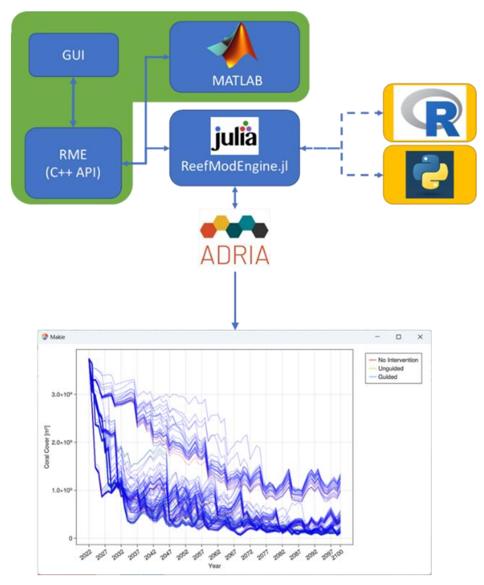
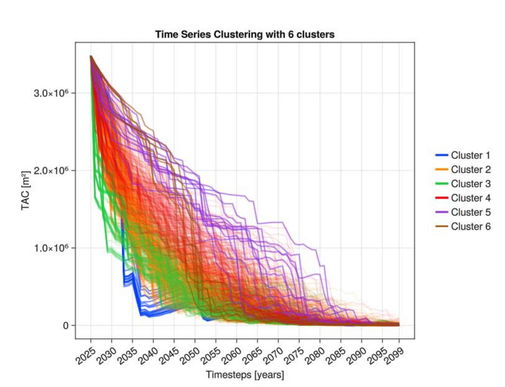
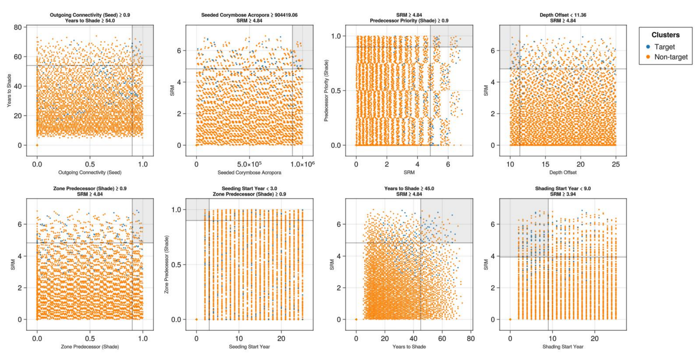

{: .no_toc }

# Decision Support System: ADRIA

  

    Table of contents
  

{: .text-delta }
* TOC
{:toc}
____

The Adaptive Dynamic Reef Intervention Algorithms (ADRIA) is a decision support platform designed to inform reef restoration and adaptation efforts through: 
- scenario exploration and analysis, 
- heuristic decision simulation, and
- ecosystem modelling. 

## Scenario exploration and analysis

ADRIA provides an assessment framework and accompanying suite of analysis methods to explore the implications of management strategies (both implicit and explicit) under a range of plausible environmental, logistical, or policy conditions and assumptions around ecosystem state and behaviour. 

The principal concern is the identification of strategies that, if adopted, will improve the likelihood of beneficial outcomes experienced across the range of assumptions and potential future conditions, i.e., outcomes that are robust across space and time. The approach does not require intervention strategies to be explicitly defined and allows for a more complete consideration of the uncertainties at play in the assessment of scenario outcomes.

**Key features**
- Programmatic interfacing with other RRAP models. ADRIA decision simulations can be run in tandem with the [ReefMod Engine](/../../capability/intervention-modelling) through a Julia package that allows for dynamic interoperation (Figure 1). In such a use case, ADRIA can inform preferred intervention deployment locations for each decision point (e.g., annually) and explore the implications of each decision with the ReefMod Engine.
- ADRIA assesses and identifies scenario outcomes (i.e., the implication of an intervention strategy under given environmental conditions) which behave similarly according to a given metric, and group them into clusters. This assessment is not restricted to time series and can be explored using any data series of interest (example of absolute coral cover in Figure 2).
- ADRIA applies machine learning approaches to quickly identify (“induce”) scenario conditions that must hold true for a given outcome to be realised or experienced. This can be used to explore governing rules that lead to clusters during scenario outcomes assessment (Figure 3). 

***Figure 1.** Component relationships between ADRIA, the ReefMod Engine interface for the Julia language (ReefModEngine.jl), and the ReefMod modelling ecosystem in general (green outline). Results can be visualised to indicate scenario outcomes. Hypothetical interfaces for other languages are marked in yellow*

***Figure 2.** Example scenario trajectories grouped into six clusters according to their temporal behaviour for a given metric (total absolute coral cover or TAC)*

***Figure 3.** Rules induced from clustered time series analysis shown in Figure 14. The scenario cluster of interest is Cluster 5, which displays the largest benefit maintained for the longest time relative to simulation start. Focusing on the bottom right panel, it is perhaps not surprising that high levels of Solar Radiation Management (SRM ≥ 3.94, aka cloud brightening) beginning in the next 9 years (Shading Start Year < 9) improves the likelihood of experiencing these outcomes.*

## Heuristic decision simulation

ADRIA provides a toolset based on Multi-Criteria Decision Analysis (MCDA) used to emulate decision makers with a range of preferences and risk appetites. It provides assessment and prioritisation based on known spatial objectives and policy preferences according to projected environmental conditions.

## Ecosystem modelling

ADRIA currently bundles a coral ecosystem model (ADRIAMod) to enable comparatively quick exploration of scenario outcomes. It now represents six functional coral types, and two key environmental stressors of heat (in the form of degree heating weeks; DHWs) and wave stress. An approach to representing natural adaptation processes has also been recently added. 

Discussions are ongoing to incorporate further environmental stressors (Crown of Thorn Starfish and Ocean Acidification). 

In terms of interventions, the model is used to simulate deployment of thermally enhanced corals, fogging and regional Marine Cloud Brightening. 

**More information on ADRIAMod: [here](/../../modelling/ecological_mod)**

ADRIA is openly developed and fully open source. ADRIA is currently hosted at: [https://github.com/open-AIMS/ADRIA.jl](https://github.com/open-AIMS/ADRIA.jl){:target="\_blank"} with documentation providing an overview of usage and capabilities hosted at [https://open-aims.github.io/ADRIA.jl/stable/](https://open-aims.github.io/ADRIA.jl/stable/){:target="\_blank"}
