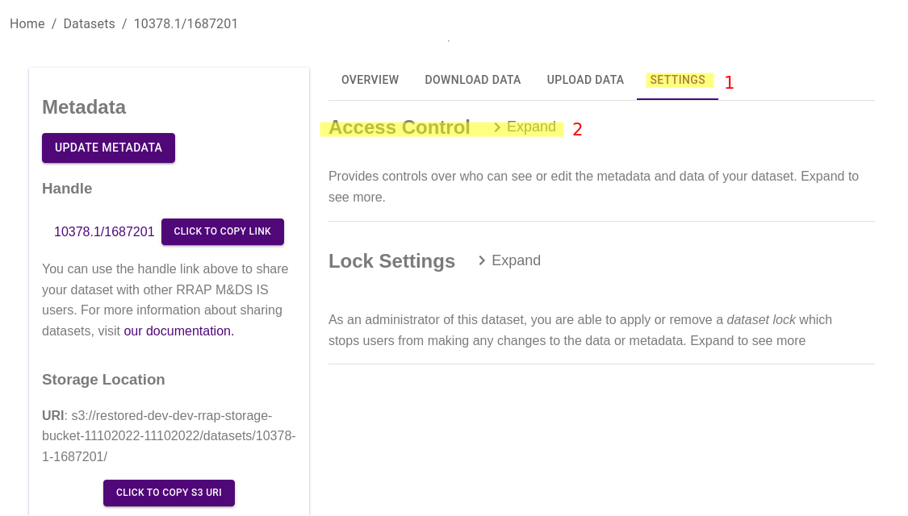
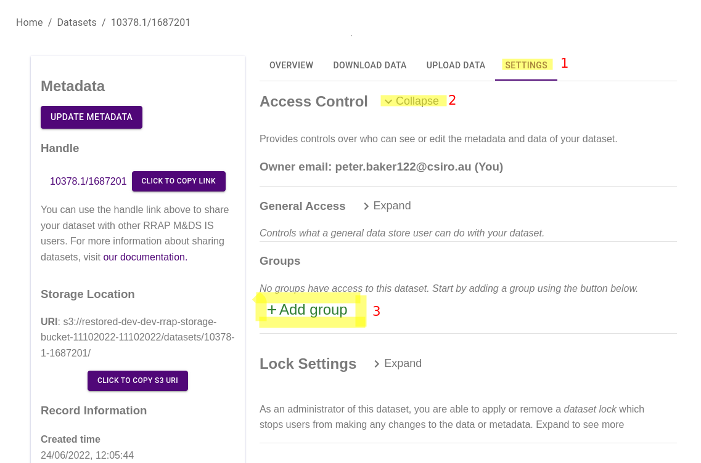
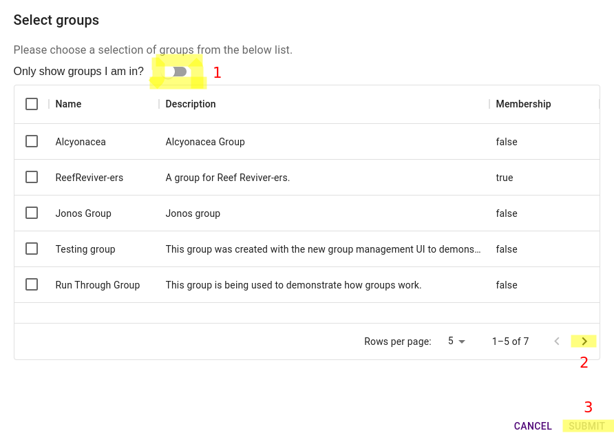

{: .no_toc }

  

    Table of contents
  

{: .text-delta }
* TOC
{:toc}
____

# Access Control Overview

This document will discuss the types of access controls available and then discuss the methods to apply these access controls through the Data Store user interface.

## What access controls are available for datasets?

There are three access rights to consider:

1. Metadata access
2. Data access
3. Admin access

## Metadata access

Metadata access determines if a user can discover, view and update information about a dataset.

### Metadata Read

#### Description

-   If granted, users will be able to find the dataset in the Data Store and view the dataset's metadata.
-   If not granted, users will not be able to find the dataset in the Data Store nor view the dataset's metadata.

### Metadata Write

#### Automatically Grants

-   Metadata Read

#### Description

-   If granted, users can modify the dataset metadata
-   If not granted, users will not be able to update the metadata.

## Data access

Data access determines if a user can download, upload and modify the files within a dataset.

### Data read

#### Automatically Grants

-   Metadata Read

#### Description

-   If granted, the download panel will become visible to users and they will be able to download the dataset's files.
-   If not granted, the download panel will not be visible and users will not be able to download the dataset's files.

### Data write

#### Automatically Grants

-   Metadata Read
-   Metadata Write
-   Data Read

#### Description

-   If granted, users will have complete control over the dataset's files - this includes upload, modification and deletion.
-   If not granted, users will not be able to modify the dataset's files.

## Admin access

#### Automatically Grants

-   Metadata Read
-   Metadata Write
-   Data Read
-   Data Write

#### Description

If granted, provides full control over a dataset. Administrators of a dataset are granted all of the above permissions, and can additionally:

-   reconfigure access (see below)
-   apply or remove [dataset locks](/dataset_lock.html){:target="\_blank"}

# Applying Access Controls

The aforementioned controls can be applied for individual datasets by those who have administrative access to the dataset. By default, this is the owner of the dataset and Data Store administrators.

Each dataset specifies an access configuration. This configuration defines a set of access grants for a selection of groups. All datasets must specify at least one set of access grants for the default "General Users" group, as defined below. Users can configure extra access grants for custom user groups as discussed below.

## Overview

### Finding dataset settings

The dataset settings (1) and access settings (2) (shown below) are only visible if you are a dataset adminstrator.

|                                         Finding dataset settings                                          |
| :-------------------------------------------------------------------------------------------------------: |
|  |

### Making changes

### Submitting changes

## General user access

### Who are general users?

The "General Users" group contains all users of the Data Store. Each dataset must specify a set of access grants for this group. This could range from no access (non discoverable and non accessible), to complete access (data write or even administrative).

When a new dataset is created, the General Users group is assigned only metadata read permission. This configuration can be modified using the processes detailed below.

### Where to manage general user access

Upon registering a dataset, the general Data Store user access rights can be managed by navigating to the 'settings' tab when viewing the dataset. By expanding the General Access section, the metadata, data, and administrative grants can be modified.

|                                             Managing General User access                                              |
| :-------------------------------------------------------------------------------------------------------------------: |
|  |

## Group access

If granting access to all users does not provide enough control, a dataset administrator can configure access grants on a group-by-group basis. Configuring access for a group grants this access to all registered members of the group.

A dataset can be made available to more than one group with differing accessibility levels (see note below). For example, you may wish to have a group of dataset contributors which will require write access, and another group for dataset viewing only, meanwhile the more general system users may not have access at all.

**Note**: If a user is accessing a dataset which has access rules for multiple groups of which the user is a part of, the user will be granted the most permissive combination of those access rights.

### Adding group access to a dataset

You can grant group acces to a dataset you have administrative control over by viewing the dataset, navigating to the settings panel (1), expanding the Access Control section (2), and selecting "+ Add Group" (3), as highlighted below.

|                                      Adding groups to a dataset                                       |
| :---------------------------------------------------------------------------------------------------: |
|  |

The resulting popup will allow you to select from the created groups. If you only want to show groups you are in, select the toggle button (1). If you can't see the group you are looking for, you may need to visit the next page (2). Select one or more groups by clicking on the row(s), and pressing submit (3).

|                                          Submitting selected groups                                          |
| :----------------------------------------------------------------------------------------------------------: |
|  |

Once the selected groups are added, you will see the collapsed access configuration for each group in the Access Control section. By default, each group is configured with metadata read permission only. The change the access configuration for a group, press the "Expand" button next to it's name (1) and use the toggles to grant access.

|                                            Configuring group access                                             |
| :-------------------------------------------------------------------------------------------------------------: |
|  |

### Creating a group

Group creation is currently performed by Information System Administrators. Please get in touch and we can help facilitate this for you.

### Group Access typical configuration examples

If you would like all Data Store users to be able to view and download your dataset, but not edit the contents of it,
grant general user read access for both metadata read and dataset read:

|                       Enabling general user read access to dataset metadata and data                       |
| :--------------------------------------------------------------------------------------------------------: |
|  |

Furthermore, if you'd like to limit the editing rights to a group of team members, you can create an editors group and enable
write permissions for them whilst leaving the general user write permissions (for metadata and data) _not_ granted.

|                          General User Read access to dataset metadata and data                           |
| :------------------------------------------------------------------------------------------------------: |
|  |

If at some point you wish to temporarily disable all updates/writes to the dataset, it may be easier to apply a [dataset lock](./information-system/data-store/dataset_lock.html){:target="\_blank"} as opposed to the potentially more complex task of managing the group/user roles.

### Remove Group Access

A groups access rights to a dataset can be removed by removing the entire group from the datasets list of groups as opposed to disabling the groups roles. This will not delete the group.

|                         General User Read access to dataset metadata and data                         |
| :---------------------------------------------------------------------------------------------------: |
|  |
