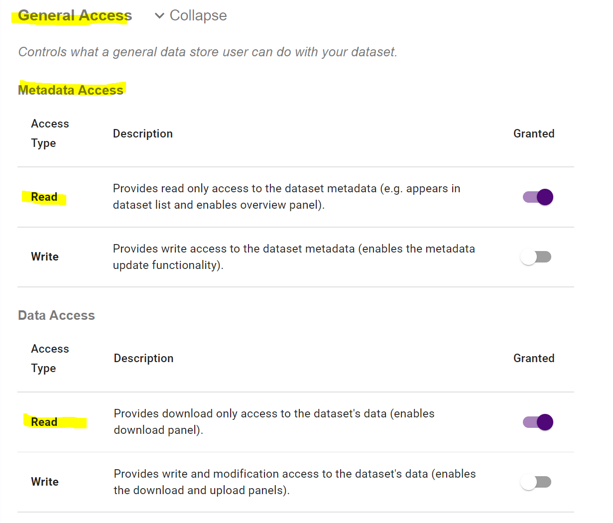
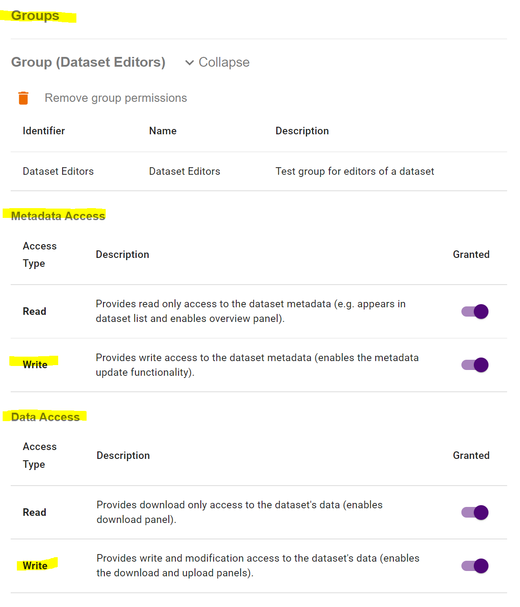
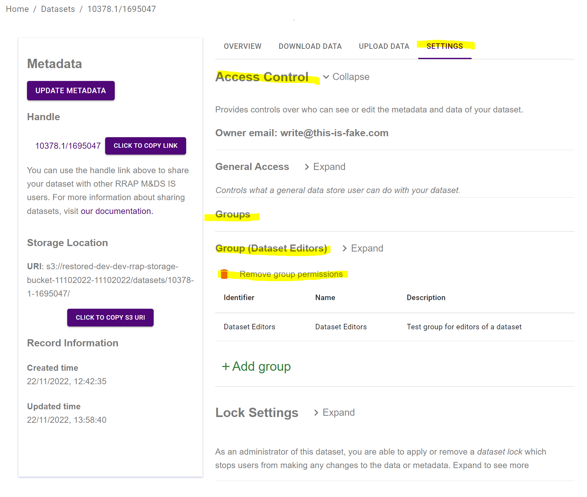

{: .no_toc }

  

    Table of contents
  

{: .text-delta }
* TOC
{:toc}
____

# Access Control Overview

This document will discuss the types of access controls available and then discuss the methods to apply these access controls through the Data Store user interface. 

## What access controls are available for datasets?
 
There are three access rights to consider: 

1. Metadata access
2. Data access
3. Admin access

## Metadata access

Metadata access determines if a user can discover, view and update information about a dataset.

### Metadata Read

- If granted, users will be able to find the dataset in the Data Store and view the dataset's metadata. 
- If not granted, users will not be able to find the dataset in the Data Store nor view the dataset's metadata.

### Metadata Write

- If enabled, users can update metadata fields and will be granted metadata read access regardless of the setting for metadata read.
- If disabled, general users will not be able to update the metadata.

## Data access

Facilitates control over the upload/download of data to/from the storage location associated with the dataset.

### Data read

- If enabled, the download panel will become visible to users and they will be able to download data from the storage location. 
- If disabled, the download panel will not be visible and users will not be able to download data from the storage location.

### Data write

- If enabled, users will be able to upload/overwrite and download to/from the storage location as both the upload and download panels will be made available to general users.
- If disabled, users will not be able to upload/overwrite data in the storage location.

## Admin access

- If enabled, provides administrative control over the dataset. That is, the ability to lock and unlock the dataset in addition to all of the above privileges. For more information on locking and unlocking, see [dataset lock](./information-system/data-store/dataset_lock.html){:target="\_blank"}.

# Applying Access Controls

The aforementioned controls can be applied for individual datasets by those who have administration access to the dataset. By default, this is the owner of the dataset and Information System Admins.

Each dataset can have a rule for its accessibility to (the group of all) general datastore users, and (optionally) extra rules for multiple custom groups of users. The following sections will discuss these.  

## General user access to dataset

### Who are general users?

General Datastore users refers to the group of all users who can access the datastore. As such, general user access controls facilitate the general privacy or publicity (to all datastore users) of a dataset. You could limit access controls for general users if you wish to keep your dataset private to a group (perhaps during development processes and then later release it by updating general user access rights).

### Where to manage general user access

Upon registering a dataset, the general datastore user access rights can be managed by navigating to the 'settings' tab when viewing the dataset.

| Managing General User access |
|:-:|
||

In future versions of the IS, the ability to set access levels during the registration process will be implemented. For now, a workaround is to register a dataset with meaningless metadata, limit general access privileges, then meaningfully update the metadata as you wish.

## Group access to dataset

The group access feature enables custom permissions for groups (and thus members) to a dataset. This can achieve the privatisation of datasets to only certain users of the information system by *not* enabling general user read/write permissions and creating a group with enabled read/write permissions for its members.

### Creating a group

Group creation is currently performed by Information System Administrators. Please get in touch and we can help facilitate this for you.

### Adding group access to datasets

Groups access to datasets can be managed by navigating to the dataset's settings tab, then Access Control, then Groups. Here, group permission can be added to the dataset. Group access levels for this dataset can also be edited here by selecting the group (see below for a typical example).

| Adding groups to dataset access |
|:-:|
||

A dataset can be made available to more than one group with differing accessibility levels (see note below). For example, you may wish to have a group of dataset contributors which will require write access, and another group for dataset viewing only, meanwhile the more general system users may not have access at all. 

**Note**: If a user is accessing a dataset which has access rules for multiple groups of which the user is all apart of, the user will be given the more permissive access rights. This is because enabling an access right is seen as a "granting" action, meanwhile not enabling an access right is *not* seen as 'denying' access. Therefore, roles can only grant access, not deny.

### Group Access typical configuration examples

If you would like all datastore users to be able to view and download your dataset (metadata and data), but not edit the contents of it,
grant general user read access for both metadata read and dataset read:

| Enabling general user read access to dataset metadata and data |
|:-:|
||

Furthermore, if you'd like to limit the editing rights to a group of team members, you can create an editors group and enable
write permissions for them whilst leaving the general user write permissions (for metadata and data) *not* granted.

| General User Read access to dataset metadata and data |
|:-:|
||

If at some point you wish to temporarily disable all updates/writes to the dataset, it may be easier to apply a [dataset lock](./information-system/data-store/dataset_lock.html){:target="\_blank"} as opposed to the potentially more complex task of managing the group/user roles.

### Remove Group Access

A groups access rights to a dataset can be removed by removing the entire group from the datasets list of groups as opposed to disabling the groups roles. This will not delete the group.

| General User Read access to dataset metadata and data |
|:-:|
||

