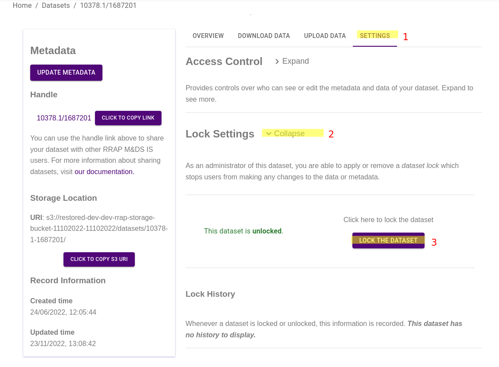

{: .no_toc }

  

    Table of contents
  

{: .text-delta }
* TOC
{:toc}
____

## What is a dataset lock?

Datasets in the Data Store can be "locked" to prevent changes to the dataset's data or metadata until it is unlocked.

## What happens when a dataset is locked?

Locked datasets are displayed differently to Data Store users. A locked dataset is indicated by a grey lock icon in the settings and upload tabs.

The locking of a dataset is not just cosmetic, the APIs which grant credentials will enforce this status, responding with an error message in the case of an invalid request, as shown below.

|                           Requesting upload credentials for a locked dataset                            |
| :-----------------------------------------------------------------------------------------------------: |
|  |

If a dataset is locked, the settings panel will display the locked status, for example:

|                              View of locked Dataset in settings tab                              |
| :----------------------------------------------------------------------------------------------: |
|  |

If a dataset is locked, the upload tab will show a customised message:

|                                 View of locked Dataset in upload tab                                 |
| :--------------------------------------------------------------------------------------------------: |
|  |

## Who can lock a dataset?

Dataset locks can be applied and removed by users who have administrative access to the dataset. See [access control](/access-control.html){:target="\_blank"} for more information about dataset access.

## How to add or remove a dataset lock

To apply or remove a lock, navigate to the dataset in the Data Store, select the "settings" tab (1), then the "Lock Settings" drop down (2), and finally, "Lock The Dataset" (3).

|                                       Accessing lock controls                                       |
| :-------------------------------------------------------------------------------------------------: |
|  |

A helpful, brief justification must be provided for the lock or unlock action. Your identity (email) and justification will be logged in the dataset's lock history (visible below). As an example of a suitable lock justification is "completed initial round of modelling and outputs finalised".

|                                           Dataset lock history                                            |
| :-------------------------------------------------------------------------------------------------------: |
|  |
