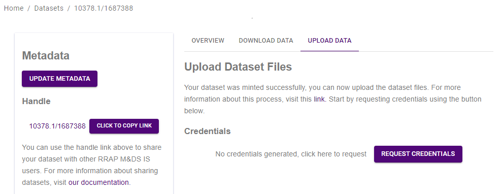
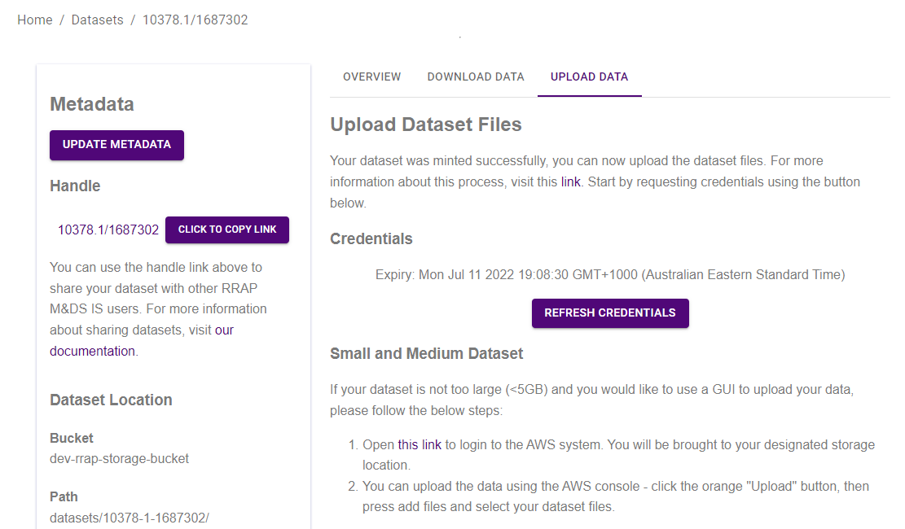
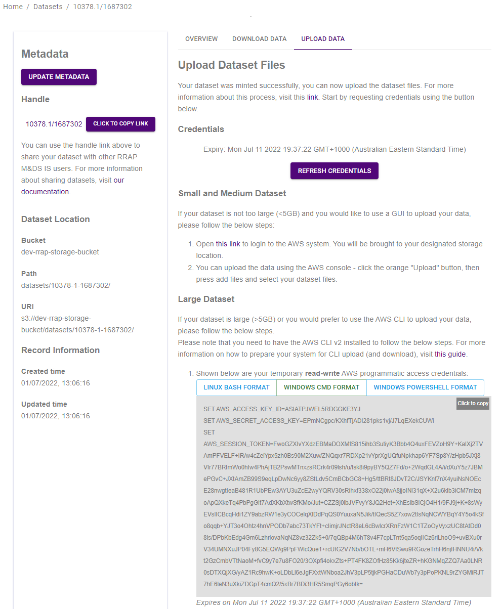

{: .no_toc }

# Registering and uploading a dataset

  

    Table of contents
  

{: .text-delta }
* TOC
{:toc}
____

## Overview

The diagram below outlines the steps undertaken when registering and uploading a dataset.  
_Note: draft figure_

_A User logs into the RRAP information system & selects DATASTORE then REGISTER DATASET from the website. A metadata form prefilled with the User’s name & email address opens and the User fills out information relating to the data being uploaded (see [Filling out form fields](#filling-out-form-fields){:target="\_blank"} for more detailed information). After the metadata form is completed the User uploads the dataset by one of these [methods](#how-do-i-upload-dataset-files){:target="\_blank"}, depending on the size of the file(s). The data is assigned its own unique PID (Persistent Identifier). The data is securely stored on an AWS S3 server, ready for future reference and usage._
 

___
## Registering a dataset
When registering a dataset with the RRAP-IS Data Store you are initially required to complete a metadata record. The inputs requested are listed below, make sure you have these prior to filling out the form. After submitting, the system generates a persistent unique identifier that can be used similarly to a Digital Object Identifier (DOI). The generation of metadata records will facilitate the sharing and discovery of data.

___
### Filling out form fields
User entered metadata fields are listed below, some of which are prepopulated, others are selected or searched for with the help of form widgets. 



#### Auto generated metadata fields

After the user **Submits** the newly registered dataset the RRAP-IS system will mint a **Handle** and allocate a directory in RRAP-IS online data storage. The **Handle** identifier and data directory path will be included in the metadata record.



___
### Missing fields

After clicking **Submit** if a mandatory/**required** field is not given a popup will appear indicating that important information is missing.

Users will not be able to progress unless all required fields are entered.

___
### Usage licence

Users can just attribute the appropriate licence from the dropdown list. There are four licenses to choose from, although all data produced by RRAP is by default attributed Copyright 'All rights reserved'. For details of each license please see the [Licenses](../licenses.md){:target="\_blank"} page.

___
### What happens during the minting dataset process?

A Handle Identifier is minted with each dataset that is registered and will associated with the dataset metadata. This minted identifier can be used to persistently locate your dataset in the future. See [Digital Object Identifiers](../digital-object-identifiers.md){:target="\_blank"} for further details.

___
## File types and maximum file size

The M&DS IS Data Store can store a variety of data files e.g. text files, netCDF, word documents, images etc... Users can upload files or folders using either the AWS web console (GUI), AWS command line interface (AWS CLI) or a program like [WinSCP](../data-store/WinSCP-data-access.md).

While the AWS CLI can handle large files (>100GB) and the AWS Console GUI can handle up to 160GB uploads, please contact the RRAP M&DS IS team if you know you will be uploading large or numerous files. For technical information about the storage limitations of the S3 service (which the data store is built on) you can review the AWS FAQ [here](https://aws.amazon.com/s3/faqs/#:~:text=How%20much%20data%20can%20I%20store%20in%20Amazon%20S3?){:target="\_blank"}.

The maxium file size that can be uploaded is 5TB.  

___
## How do I upload dataset files?



___
### Uploading data via AWS Web Console - small to medium files
Once the metadata record is created, if you have a dataset that is not too large (<5GB) and you would like to use a GUI to upload your data, you can upload data using the AWS web console. Click on the *Upload data* tab.

|                                 Upload data                                              |
| :---------------------------------------------------------------------------------:      |
|  |

Request credentials by clicking the *Request Credentials* button. 

|                                 Uploading small to medium files                          |
| :---------------------------------------------------------------------------------:      |
|  |

Next, open the link to AWS system, you will then be taken to the AWS S3 bucket location which will contain the dataset files. The associated metadata record will be seen as a ro-create-meatadata.json file.  
  
Click the orange *Upload* button, then click on *Add files* or *Add folder* depending on what you want to upload. 
Click on the orange *Upload* button at the bottom of the screen to complete the process. Press *Close* to return to the S3 bucket. Close the browser to exit.

If you need to add additional files to your dataset, you can do this by repaeating the steps above.

___

### Uploading files via WinSCP - any size files
If you would prefer to use a GIU to upload larger files, then WinSCP can be used. Instructions on how to do this are [here](./WinSCP-data-access.html).

___
### Uploading files via the AWS Command Line Interface (AWS CLI) - any size files
If your dataset is large (>5GB) or you would prefer to use a command line to upload your data, you can use the AWS CLI.
   
**Setting up the AWS CLI v2**  
In order to use the AWS CLI for uploading (and downloading) you will need to install it first. Please see [this page](./setting-up-the-aws-cli.html){:target="\_blank"} for instructions on how to setup the AWS CLI v2 on your system.

**Uploading files**  
Once the AWS CLI is installed copy the AWS access credentials you require (LINUX, Windows CMD or Powershell) by clicking on the *Click to copy* button.  
Paste the credentials into your AWS CLI terminal.  
Navigate to the location of your dataset (the XXXXX should be the folder where your dataset is)   
`aws s3 sync dataset/ s3://dev-rrap-storage-bucket/XXXXX/10378-1-1687302/`   
Verify that the files were uploaded correctly by running the following command and verifying the contents are accurate:  
`aws s3 ls s3://dev-rrap-storage-bucket/datasets/10378-1-1687302/`  

|                                 Uploading large files                                    |
| :---------------------------------------------------------------------------------:      |
|  |

