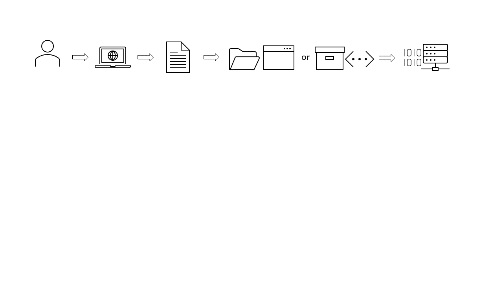

{: .no_toc }

# Registering and uploading a dataset

  

    Table of contents
  

{: .text-delta }
* TOC
{:toc}
____

## Overview

The diagram below outlines the steps undertaken when registering and uploading a dataset.  
_Note: draft figure_

_A User logs into the RRAP information system & selects DATASTORE then REGISTER DATASET from the website. A metadata form prefilled with the User’s name & email address opens and the User fills out information relating to the data being uploaded (see [Filling out form fields](#filling-out-form-fields) for more detailed information). After the metadata form is completed the User uploads the dataset by one of [two methods](#how-do-i-upload-dataset-files), depending on the size of the file(s). The data is assigned its own unique PID (Persistent Identifier). The data is securely stored on an AWS S3 server, ready for future reference and usage._
 

___
## Registering a dataset

When registering a dataset with the RRAP-IS Data Store you are initially required to complete a metadata record. The inputs requested are listed below, make sure you have these prior to filling out the form. After submitting, the system generates a persistent unique identifier that can be used similarly to a Digital Object Identifier (DOI). The generation of metadata records will facilitate the sharing and discovery of data.

___
### Filling out form fields

Author details  
>>- **_Name_**: The name of the person who created the dataset - **[Autofilled & Required]** 
>>- **_Email_**: Email of the person currently filling out the form - **[Autofilled & Required]** 
>>- **_Orcid_**: This is optional and is associated to the data creator 

Publisher details  
>>- **_Organisation_**: The name of the organisation from which the dataset originated - **[Searchable & Required]** 

Dataset details  
>>- **_Dataset name_**: Identify the dataset to humans well enough to disambiguate it from other datasets - **[Required]** 
>>- **_Dataset description_**: Short description of the dataset, further elaborate on the name to provide a summary of the context in which the dataset is important - **[Required]** 
>>- **_Publish date_**: Current date **[Autofilled & Required]** 
>>- **_Usage license_**: Select from a dropdown list - **[Selectable & Required]** 
>>- **_Dataset version_**: This identifies unique versions of the dataset 

Keywords  
>>- **_Keyword_**: List of keywords that will be used for indexing 

___
### Missing fields

After clicking **Submit** if a mandatory/**required** field is not given a popup will appear indicating that important information is missing.

Users will not be able to progress unless all required fields are entered.

___
### Usage licence

Users can just attribute the appropriate licence from the dropdown list. There are four licenses to choose from, although all data produced by RRAP is by default attributed copyright. For details of each license please see the [Licenses](../licenses.md) page.

___
### What happens during the minting dataset process?

A Handle Identifier is minted with each dataset that is registered and will associated with the dataset metadata. This minted identifier can be used to persistently locate your dataset in the future. See [Digital Object Identifiers](../digital-object-identifiers.md) for further details.

___
### Maximum file size

While the AWS CLI can handle large files (>100GB) and the AWS Console GUI can handle up to 160GB uploads, please contact the RRAP M&DS IS team if you know you will be uploading large or numerous files. For technical information about the storage limitations of the S3 service (which the data store is built on) you can review the AWS FAQ [here](https://aws.amazon.com/s3/faqs/#:~:text=How%20much%20data%20can%20I%20store%20in%20Amazon%20S3?).

___
## How do I upload dataset files?



___
### Setting up the AWS CLI v2

In order to use the CLI for uploading (and downloading) you will need to install it first. Please see [this page](./setting-up-the-aws-cli.html) for instructions on how to setup the AWS CLI v2 on your system.

>> **Upload data via AWS Web Console** -
>> If your dataset is not too large (<5GB) and you would like to use a GUI to upload your data, you can upload data using the AWS web interface.

>> 1. Open this [link](https://auth.dev.rrap-is.com/auth/realms/rrap/protocol/saml/clients/amazon-aws) to login to the AWS system - choose read/write user. And return to this page (you can close the other page if you wish).
>> 1. This [link](https://s3.console.aws.amazon.com/s3/buckets/rrap-storage-bucket?region=ap-southeast-2&prefix=datasets/) will take you to the S3 bucket location which contains all datasets.  Browse or search for your unique folder using the handle number #####.#/#######. You can upload the data using the AWS console - click the orange "Upload" button, then press choose files and select your dataset files.

___
### Uploading files after registration

After clicking **_Submit_** button a form will appear that lists the steps for uploading your data. There are currently two options to complete this task.

> > **Upload data via AWS Web Console** -
> > If your dataset is not too large (<5GB) and you would like to use a GUI to upload your data, you can upload data using the AWS web interface.
> >
> > 1.  Open this [link](https://auth.rrap-is.com/auth/realms/rrap/protocol/saml/clients/amazon-aws) to login to the AWS system - choose read/write user. And return to this page (you can close the other page if you wish).
> > 1.  This [link](https://s3.console.aws.amazon.com/s3/buckets/rrap-storage-bucket?region=ap-southeast-2&prefix=datasets/) will take you to the S3 bucket location which contains your data. You can upload the data using the AWS console - click the orange "Upload" button, then press choose files and select your dataset files.

> > **Upload data via AWS Command Line Interface (CLI)** -
> > If your dataset is large (>5GB) and/or you would prefer to use the AWS CLI to upload your data steps for this are listed on the form after submitting.
