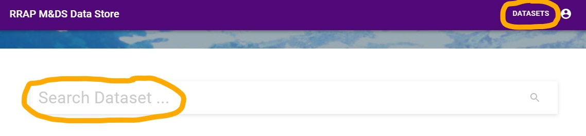
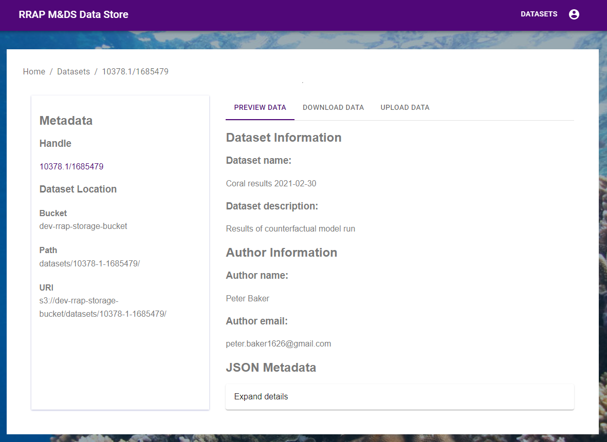

{: .no_toc }
# Viewing a dataset

  

    Table of contents
  

{: .text-delta }
* TOC
{:toc}
____

To view a dataset once you are logged into the RRAP M&DS Data Store, click on **DATASETS** or search for the dataset by entering information, such as the dataset name, in the **Search Dataset** field and clicking the magnifying glass button.
You can also click the **Browse datasets** link located under the *Find out more* menu.

 
 
 
You are then taken to the Datasets page.

 
 
 
On this page, Users can quickly filter datasets by organisation by selecting the check boxes beside each name. Once you have found the dataset you are looking for, click on the dataset name and you will then be taken to the dataset's metadata page.

The metadata page has the following information
- Metadata
    - Handle 
    - Dataset location
      - Bucket
      - Path
      - URI
- Dataset Information
  - Dataset name
  - Dataset description
  - Author information
    - Author name
    - Author email
  - JSON Metadata

Users can share the dataset with others using the Handle link. The Dataset location information relates to the storage location on the AWS S3 server.
The JSON Metadata can be expanded and the information copied by first clicking **Expand details**, then the **copy** button. To close the expanded view, click on **Expand details** again.

On the right hand side of the page, Users can also [download the dataset](../data-store/downloading-datasets.html) and [upload additional data](../data-store/registering-and-uploading-a-dataset.html) by clicking the corresponding tabs.
