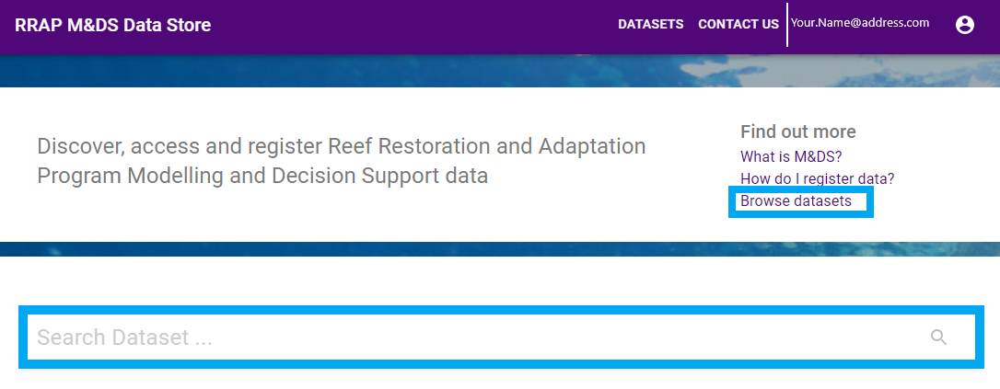
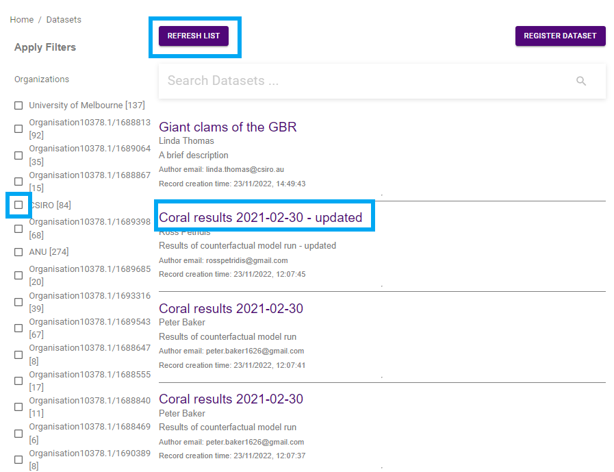
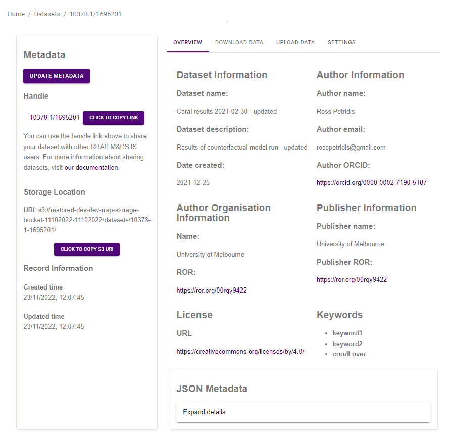
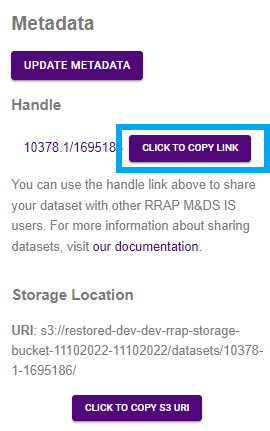

{: .no_toc }
# Viewing a dataset

  

    Table of contents
  

{: .text-delta }
* TOC
{:toc}
____

## Viewing a dataset
You can view a dataset a number of ways once you are logged into the RRAP M&DS IS Data Store by:

* Clicking on the **Explore datasets** button
* Entering information, such as the dataset name, in the **Search Datasets** field and clicking the magnifying glass button

|                                     Viewing datasets                             |
| :-----------------------------------------------------------------------------: |
|       |

You are then taken to the Datasets page, where you can:
* Quickly filter datasets by organisation by selecting the check boxes beside each name
* Select the dataset you are interested in by clicking the dataset title 
* Refresh your search by clicking the **Refresh list** button

 

|                                     Datasets page                               |
| :-----------------------------------------------------------------------------: |
|      |

Once you have found the dataset you are looking for, click on the dataset name and you will then be taken to the dataset's metadata page.

|                                   Dataset metadata view                     |
| :------------------------------------------------------------------------------: |
|       |

## Metadata
The metadata overview gives the basic information about the data that is stored in the RRAP M&DS Information System. See [describing a dataset](../data-store/describing-dataset.md) for more information on metadata.

## Collaborating
You can share the dataset with others using the Handle link. Using the Handle link to share data is an easy way of sharing files as updates to the data can be made and the user with the link will always have access the most up to date data.
The Handle link is a persistent digital identifier for the dataset. See [About digital object identifiers](../digital-object-identifiers.html){:target="\_blank"} for more information.  
  
To share, click on the **Click to copy link** button. Then paste the link into an email, document etc... that is to be shared with other RRAP M&DS Information System users. 

|                                     Dataset handle link                           |
| :-------------------------------------------------------------------------: |
|      | 
 



Underneath the Handle link, the **Storage Location** information relates to the storage location on the AWS S3 server. The **Record Information** gives you the date and time of the creation of the metadata record, with any updates to the metadata record shown under **Updated time**.

On the right hand side of the page, you can see an overview of the metadata and can also [download the dataset](../data-store/downloading-datasets.html){:target="\_blank"}, [upload additional data](../data-store/registering-and-uploading-a-dataset.html){:target="\_blank"} and, if you have privileges, change the [access control](../data-store/access-control.md){:target="\_blank"} of the dataset by clicking the corresponding tabs. The **JSON Metadata** can be expanded (so the information can be viewed or copied) by clicking on the **Expand details** button. To close, click the **Expand details** button again. 

