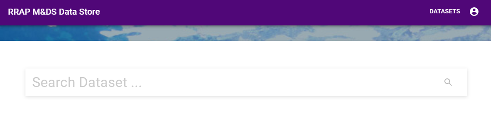

{: .no_toc }
# Viewing a dataset

  

    Table of contents
  

{: .text-delta }
* TOC
{:toc}
____

A dataset can be viewed two different ways.

The first way to to type the dataset name in the *Search Dataset* field.  
The second way is to click on the *DATASETS* button located in the top right of the screen.

