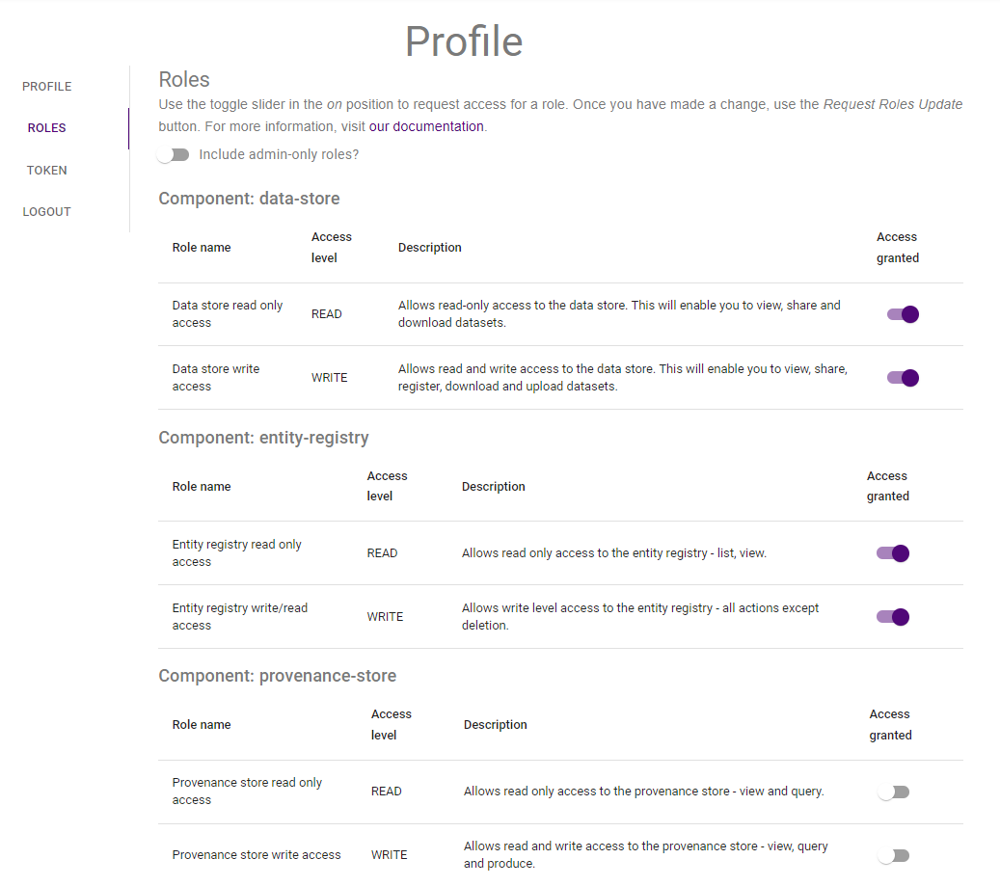
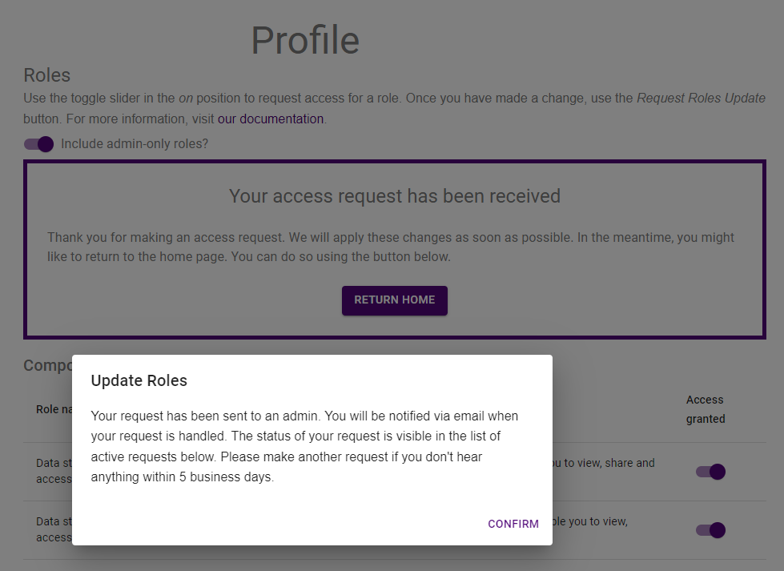

{: .no_toc }

# Requesting access to IS applications

  

    Table of contents
  

{: .text-delta }
* TOC
{:toc}
____

## User Roles
You will need to be granted roles to be able to perform tasks in the M&DS Information System. Once you are logged in on the RRAP M&DS IS [landing page](https://www.rrap-is.com){:target="\_blank"}, select the **User profile** menu .  
You then select the **Roles** tab on the left hand side of your profile page. 

| Roles tab |
|:-:|
||

## Access levels
The roles page allows you to request levels of access (read only, read and write, administration) to particular parts of the information system. 

| Component                 | Role name                          | Access level |  Description  |
| :-----------------------: | :--------------------------------: | :----------: | :--------------------------------------: |
|**Data Store**             | Data store read only access        | READ | Allows read-only access to the Data Store. This will enable users to view, share and download datasets.             |
|                           |  Data store write access           |  WRITE | Allows read and write access to the Data Store. This will enable users to view, share, register, download and upload datasets |
|**Entity registry**        | Entity registry read only access   | READ | Allows read only access to the entity registry - list, view. | 
|                           | Entity registry write/read access  | WRITE | Allows write level access to the entity registry - all actions except deletion. | 
|**Provenance store**       | Provenance store read only access  | READ | Allows read only access to the provenance store - view and query. | 
|                           | Provenance store write access      | WRITE | Allows read and write access to the provenance store - view, query and produce. | 

Below is an image of the Profile page with the access levels shown. To request access to roles, including admin roles, slide the appropriate toggle slider to the right.

|                                    User Roles                                    |
| :------------------------------------------------------------------------------: |
|  |

Once you have completed selecting the roles you require, click the **Request Roles Update** button. 

|                                   User Roles Request                                     |
| :------------------------------------------------------------------------------:         |
|  |

You then confirm the request by clicking the **Confirm** button.

|                                 User Roles Confirmation                                  |
| :---------------------------------------------------------------------------------:      |
|  |

You go back to the to the RRAP M&DS IS home page by clicking the **Return Home** button.

|                                  Return home                                              |
| :---------------------------------------------------------------------------------:      |
|          |


