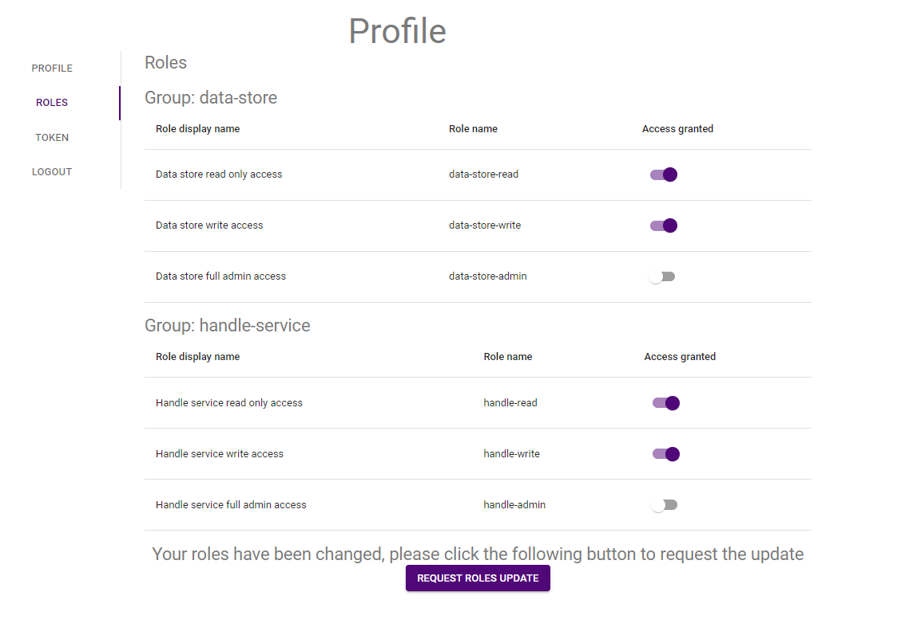
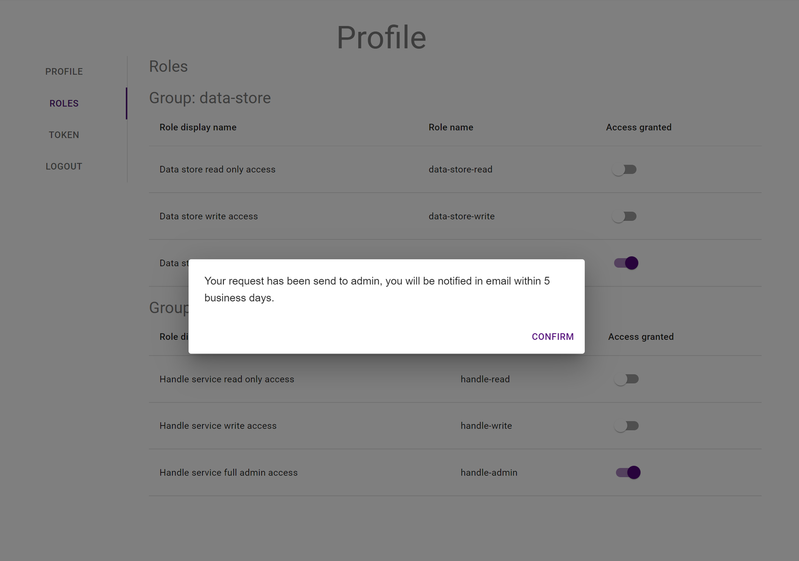

{: .no_toc }
# Requesting access to IS applications

  

    Table of contents
  

{: .text-delta }
* TOC
{:toc}
____

## User Roles
Currently users will need to select **Roles** to be able to perform tasks.  Select **Roles** under your user menu item (silhouette of a person) from the top right of page. From the **Roles** page users can request levels of access (read only, read and write, administration) to particular parts of the system

| Application  | Role  |  Access Level |
|:-:|:-:|:-:|
| Data Store | data-store-read  |   read only |
|   | data-store-write  | write |
|   | data-store-admin  | admin |
| ____  | ____  | ____ |
| Handle Service  | handle-service-read  |   read only |
|   | handle-service-write  |  write |
|   | handle-service-admin  |   admin |

| User Roles|
|:-:|
||

Request access to roles by sliding the appropriate slider to the right

| User Roles Request|
|:-:|
||


 