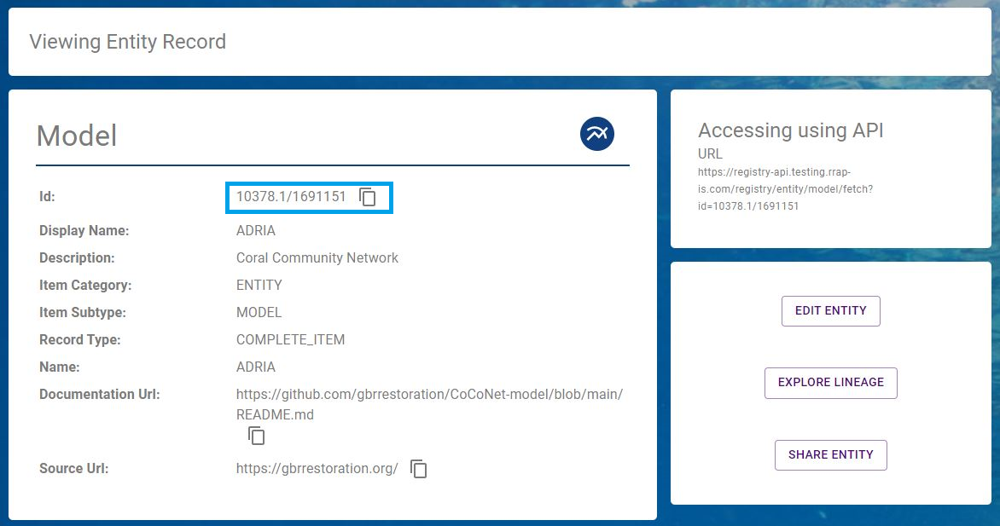

# Exploring provenance
---
{: .no_toc }
# Browsing

  

    Table of contents
  

{: .text-delta }
* TOC
{:toc}
____

## Provenance Graoh

### View 

Click on any of the tiles to view the record details, edit, share or explore lineage:

|                                   Search :                               |
| :-----------------------------------------------------------------------------: | 
|       |

### Edit Record 

Click on **EDIT ENTITY** to edit the record :

|                                   Edit :                               |
| :-----------------------------------------------------------------------------: | 
|       |

### View Lineage 

Click on **EXPLORE LINEAGE** to view the lineage of the record :

|                                   Lineage :                               |
| :-----------------------------------------------------------------------------: | 
|       |
