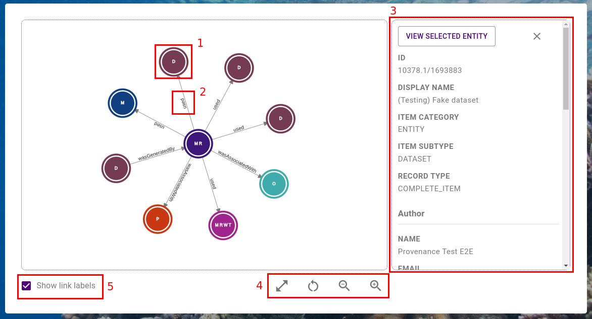

# Exploring Record Lineage

Once you have [discovered a record](./discovering-records), you can use the provenance store's graph explorer to visualise, traverse and interrogate the lineage of the record.

This page will provide conceptual and practical advice on how to use this tool.

The sections are outlined below

-   [What is the provenance graph](#what-is-the-provenance-graph) - explains what an RRAP IS provenance graph is
-   [Understanding the provenance graph explorer](#understanding-the-provenance-graph-explorer) - provides an overview of the provenance graph explorer tool - showing the components of the tool, the page layout, and basic controls
-   [Interacting with the provenance graph](#interacting-with-and-traversing-the-provenance-graph) - provides a more detailed view of how to interact with the graph and it's elements, including exploring and traversing
-   [Common issues and FAQ](#common-issues-and-faq) - provides examples of where things can go wrong, what common errors mean, and other FAQs

## What is the provenance graph

In the RRAP IS, authorised users can register records in the [Registry](../registry/overview). Users can register [Model Runs](../registering-model-runs/registration-process/overview) which connect various registered entities - representing an activity, performed at a point in time, which possibly consumes inputs and produces (or contributes to) outputs. The collection of this chain of activities collectively forms [workflow provenance](../overview/what-is-provenance).

In the RRAP IS, users can explore an interactive visualisation of registered provenance. The connections between registered entities are represented as links between nodes in a graph. In the image of a provenance graph below, a node (1) represents an item registered in the Registry. The directional link between nodes (2) represents a connection in the underlying provenance data. The connection is labelled (2) - this label describes the type of relationship between the registered entities.

|                                         Parts of the graph                                         |
| :------------------------------------------------------------------------------------------------: |
|  |

### Provenance relationships

The names and meanings of the relationships are described below:

-   A - **used** -> B - The "used" relationship means that the activity A consumed, referenced or relied on the resource B. For example, a model run 'uses' input datasets.
-   A - **wasGeneratedBy** -> B - The "wasGeneratedBy" relationship means that the entity A exists because of the activity B. For example, a model run produces output datasets.
-   A - **wasAssociatedWith** -> B - The "wasAssociatedWith" relationship means that the activity A was associated with an agent B. An agent refers to a participant or actor in a process (e.g. a Person or Organisation). Association could imply attribution or responsibility. For example, a model run is associated with a Person and, optionally, an Organisation.
-   A - **wasAttributedTo** -> B - The "wasAttributedTo" relationship means that the entity A exists because of the activities associated with the agent B. For example, a dataset produced as an output of a model run is attributed to the Person which ran the model.

For more detailed information about the meaning of these relationships, see [the PROV Ontology](https://www.w3.org/TR/prov-o/).

## Understanding the provenance graph explorer

The provenance graph explorer interactively visualises the provenance graph, as described above. In this section we will provide an overview of the parts of the explorer.

The explorer is composed of two sections - the top and bottom.

### The top section

The top section of the provenance explorer tool (shown below) provides detailed information about the "Root Record" (1), as well as a Legend (2) for the graph. The "Root Record Details" panel can be scrolled if all details are not visible. If you would like more information about a particular type of registered item, you can click the Legend entry (3) which links to the documentation of that type.

|                                        Overview of the top section                                        |
| :-------------------------------------------------------------------------------------------------------: |
|  |

The **root record** is the "starting point" of the exploration - the central node in the provenance graph. Later, we will see how to change the root node.

### The bottom section

The bottom section of the provenance explorer tool (shown below) is the main interactive visualisation of the provenance graph.

The graph contains nodes (1) and links (2). The meaning of these nodes and links was defined [above](#provenance-relationships). The right hand panel (3) contains details about the currently selected node. If no node is currently selected, the panel will be hidden. Nodes can be selected with a single click (see the [interacting section](#interacting-with-and-traversing-the-provenance-graph) for more detailed instructions). This panel is scrollable. The graph provides a set of controls (4 and 5). These controls will be explained in the [interacting section](#interacting-with-and-traversing-the-provenance-graph) below.

|                                        Overview of the bottom section                                        |
| :----------------------------------------------------------------------------------------------------------: |
|  |

## Interacting with and traversing the provenance graph

The provenance graph explorer is an interactive visualisation with various controls. We will explore these controls in three sections.

### Controlling and navigating the graph

This section covers how to

-   Pan and zoom the graph
-   Move, lock and unlock nodes
-   Disable or enable link labels

#### Panning and zooming

#### Moving, locking and unlocking nodes

#### Disabling or enabling link labels

### Investigating and interrogating the graph

This section covers how to

-   View the details of a node
-   See a summary of a node by hovering

#### Viewing node details

#### Viewing node summary

### Traversing and exploring the graph

This section will cover how to

-   Expand the graph by exploring
-   Reset the graph
-   Change the root node of the graph

#### Expanding the graph by exploring

#### Resetting the graph

#### Understanding and changing the root node

## Common issues and FAQ
