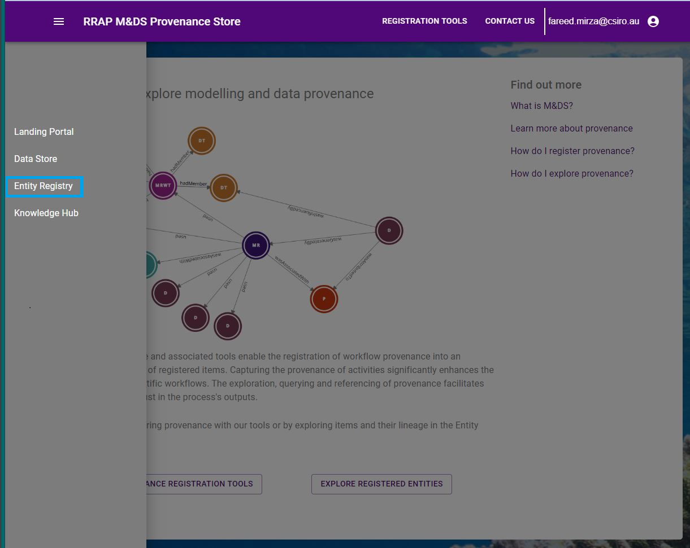

# Exploring provenance
---
{: .no_toc }
# Viewing a dataset

  

    Table of contents
  

{: .text-delta }
* TOC
{:toc}
____

## Exploring provenance
Users can explore the provenace by :

- Clicking the **Provenance Store** entry in the main menu.

|                                     Exolore Entities                             |
| :-----------------------------------------------------------------------------: |
|       |

Clicking on **Explore Registred Entities** users are then taken to the Explore and Regsiter Page.

|                                     Provenance Store                                |
| :-----------------------------------------------------------------------------: |
|     |

Clicking on **Explore Records** opens main explore entiries screen.

|                                   Explore Entities                     |
| :------------------------------------------------------------------------------: |
|       |