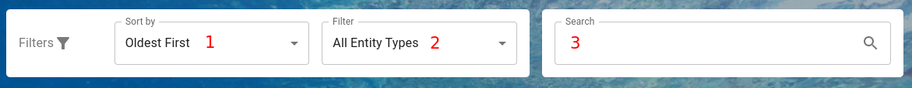
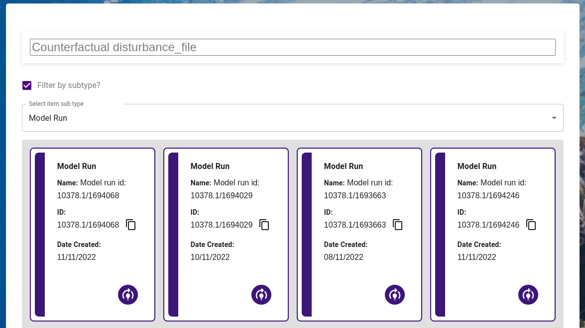
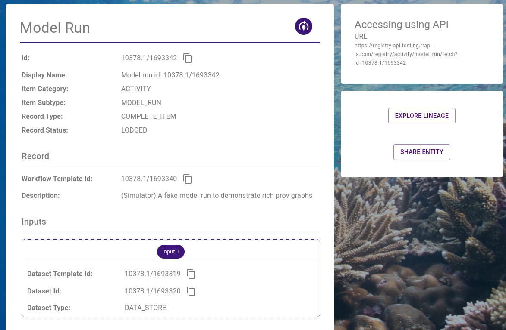

{: .no_toc }

  

    Table of contents
  

{: .text-delta }
* TOC
{:toc}
____

# Exploring the registry

## Required Permissions

-   Registry Read

## Finding records

### Listing, sorting and filtering entities

**Link**: [https://registry.mds.gbrrestoration.org/records](https://registry.mds.gbrrestoration.org/records)

This method of exploration is ideal for when you want to browse or filter a list of all the registered entities. Various filtering and sorting options means you can narrow the list to find relevant entities or get an idea of system activity.

Start by navigating to the above link. Once the registry list loads, you will see a scrollable list of entities.

Entities are distinguished in three ways. Their colour (1), icon (2) and type (3).

|                                  Record Display                                   |
| :-------------------------------------------------------------------------------: |
|  |

To view detailed information about a record, click on it's card in the grid.

You can refine the list of entities by using the sorting and filtering options. Shown below:

1. Sorting - click the dropdown and select an order this includes:
    - Oldest first
    - Newest first
    - Name
    - Entity ID
2. Filtering by type - click the dropdown and select the entity type
3. Filtering by text - click in the input box and type your query - this filters the record list for resources which contain your specified substring. You do not need to submit or confirm the search query, it will automatically search as you type.

|                                 Sorting and filtering                                 |
| :-----------------------------------------------------------------------------------: |
|  |

### Searching the registry

**Link**: [https://registry.mds.gbrrestoration.org/search](https://registry.mds.gbrrestoration.org/search)

This method of exploration is ideal when you are looking for a specific entity in the registry. The search tool can quickly search the entire registry across multiple record fields to look the words in your search term. If results are found, they are ordered by the strength of the match.

Simply enter the search query, paying attention to the spelling of your search terms - the search results will appear as you type. You can click on a result to view the detailed record information. To select a record, click on the record card.

You can also filter by entity type by ticking the "Filter by subtype?" box and selecting an entity type.

For example, the following search query "Counterfactual disturbance_file" found model run records which included a "counterfactual" annotation, and "disturbance_file" deferred resource key

|                                         Searching                                         |
| :---------------------------------------------------------------------------------------: |
|  |

## Viewing records

Once you have discovered a record, possibly by:

-   [listing, sorting and filtering records](#listing-sorting-and-filtering-entities)
-   [searching for records](#searching-the-registry)
-   having a record [shared](./sharing-an-entity.html) with you

You can view detailed information about the record by visiting it's details page.

If the record was shared with you, you will land on this page by default.

If you discovered the record yourself, simply clicking on the record will show you the record details.

Whenever you see a copy icon, as in the screenshot below, you can click to copy the [id](../../digital-object-identifiers.html) of the entity.

|                                   Record detailed view                                   |
| :--------------------------------------------------------------------------------------: |
|  |
