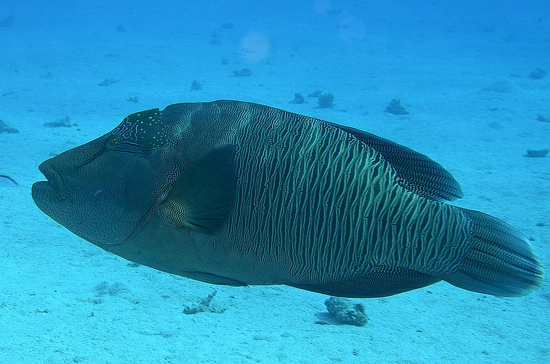

{: .no_toc }

# IS Release v2.0 Humphead Wrasse

  

    Table of contents
  

{: .text-delta }
* TOC
{:toc}
____

# 14 September 2023. Release notes RRAP M&DS IS v2.0 "Humphead wrasse"

Photo Credits: Francois Libert. Source: [Wikimedia Commons](https://commons.wikimedia.org/wiki/File:Humphead_Wrasse,_terminal_phase_-_Cheilinus_undulatus.jpg)

Refer to previous release notes:

-   [v1.4 release](https://gbrrestoration.github.io/rrap-mds-knowledge-hub/information-system/release-notes/v1-4.html)

## Version 2.0

### Main Features

-   **Registry**
    -  Registry versioning - enables traceability of registered items across the different versions (e.g. Model software, morel run templates) - learn more about versioning [here](http://docs.provena.io/versioning/versioning-overview.html)
    -   Item clone feature - enables the creation of new Registry Item's where the form details are prefilled from an existing item - learn more [here](../provenance/registry/clone)
    -   Addition of ethics and consent check in Person item types
-   **Data Store**
    -   Dataset versioning - allowing traceability of dataset lineage across versions - learn more about versioning [here](http://docs.provena.io/versioning/versioning-overview.html)
    -   Dataset release workflow - allows users to submit a release request and for approvers to review those requests. This provides a traceable approval and release papertrail. Learn more about this feature [here](http://docs.provena.io/data-store/dataset-approvals.html)
-   **Provenance Store**
    -   Additional provenance queries - The IS now has 4 new advanced querying capabilities which allows users to be able to explore provenance graphs at a greater depth, and filter by relationships and type. Learn more about this feature [here](http://docs.provena.io/provenance/exploring-provenance/exploring-record-lineage.html#advanced-provenance-queries)
-   **Infrastructure** 
    -   Generic Asynchronous Job Infrastructure (codename GAJI) - this provides a general job handling mechanism for the Provena platform.

### Minor features

-   **General**
    -   Updated integration tests
    -   System version API endpoint added
-   **Data Store**
    -   Bug fix for externally reposited metadata
    -   Layout bugs and duplicate headers
    -   Bug fixing related to error message handling
    -   Added prov graph to dataset view
-   **Registry**
    -   Layout of the registry explore view updated to fill screen width

A complete list of changes can be found [here in the release notes](https://github.com/provena/provena/releases/tag/v2.0.0)

## Citation

CSIRO (2023), RRAP M&DS Information System Release notes version 2.0 "Humpback wrasse"
