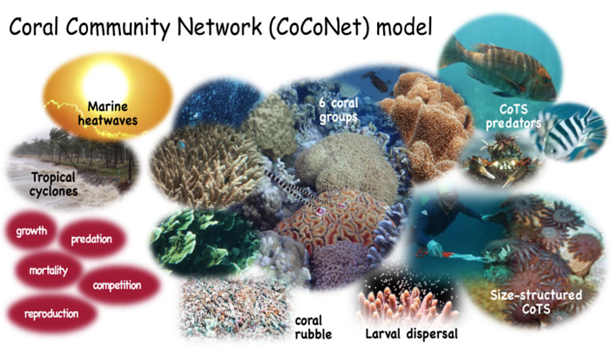

# CoCoNet
The CoCoNet (Coral Community Network) model was developed to explore the role of physical and ecological processes in controlling the health of coral reef systems over both historical periods and future projections. This includes understanding reef futures under different climate scenarios (Condie & Porobic, 2023). In addition, the computational efficiency of CoCoNet supports large ensemble runs that can be used to rigorously estimate model uncertainty. 

CoCoNet is a meta-community model that includes communities of corals and age-structured CoTS populations distributed across a network of 3806 reefs (Figure 1). Within the Coral Community Network each reef has a fixed coral carrying capacity proportional to the area of the reef. Coral communities consist of five coral groups whose species are relatively abundant on the GBR (staghorn Acropora, tabular Acropora, Montipora, Poritidae and favids). These groups are distinguished within the model in terms of their growth rates, preference by CoTS, and susceptibility to environmental impacts such as cyclones and marine heatwaves. Differences in fecundity among coral groups are assumed to be negligible compared with differences in environmental susceptibility and independent of geographical location along the GBR.

*Composite image of key CoCoNet components, including environmental forcing, ecological components, and processes (Condie & Porobic, 2023).*

For further detail on the aspects of CoCoNet, its calibration and user guide please refer to the following resources below. 

___
Condie, S; Plagányi-Lloyd, E.; Morello, B.; Hock, K.; Beeden, R., 2018. Great Barrier Reef recovery through 
multiple interventions. Conservation Biology. 32(6):1356-1367. https://doi.org/10.1111/cobi.13161.

Condie, S.; Anthony, K.R.N.; Babcock, R.; Baird, M., Beedon, R.; Fletcher, C., Gorton, R., Harrison, D., 
Hobday, A.J., Plagányi, E.E., Westcott, D.A., 2021. Large-scale interventions may delay decline of the Great 
Barrier Reef. Royal Society Open Science. 8(4):1-27. https://doi.org/10.1098/rsos.201296 .

Condie, S.A., Porobic, J., 2023. Coral Community Network (CoCoNet) Model: User Guide &Technical 
Description. CSIRO, Australia. https://doi.org/10.25919/75v0-2j98 .