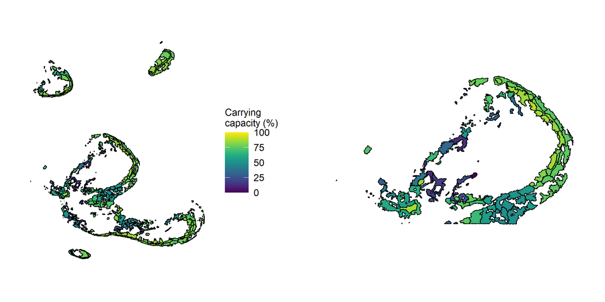
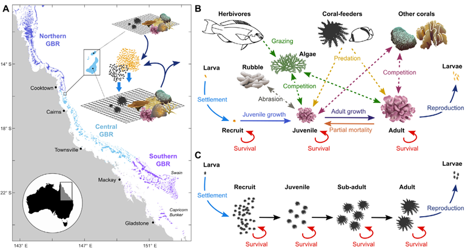

{: .no_toc }

# Ecological Modelling

  

    Table of contents
  

{: .text-delta }
* TOC
{:toc}
____

## ADRIAMod
TODO

## CoCoNet

### Model Description

The CoCoNet (Coral Community Network) model was developed to explore the role of physical and ecological processes in controlling the health of coral reef systems over both historical periods and future projections. This includes understanding reef futures under different climate scenarios (Condie & Porobic, 2023). CoCoNet is a meta-community model that includes communities of corals and age-structured CoTS populations distributed across a network of 3806 reefs (Figure 1). 

### Key Features

- The computational efficiency of CoCoNet supports large ensemble runs that can be used to rigorously estimate model uncertainty. 
- Within the Coral Community Network each reef has a fixed coral carrying capacity proportional to the area of the reef. 
- Coral communities consist of five coral groups whose species are relatively abundant on the Great Barrier Reef: Staghorn Acropora, Tabular Acropora, Montipora, Poritidae, Favids. These groups are distinguished within the model in terms of their growth rates, preference by CoTS, and susceptibility to environmental impacts such as cyclones and marine heatwaves. Differences in fecundity among coral groups are assumed to be negligible compared with differences in environmental susceptibility and independent of geographical location along the Great Barrier Reef.
- Reef connectivity, involving spawning, larval transport by ocean currents and successful settlement onto either a natal reef (self-recruitment) or neighbouring reefs (cross recruitment), is modelled as directed links that appeared and disappeared from year to year with exchanges that also vary stochastically to represent variability in ocean currents and larval survival.
- The probability of successful recruitment from one reef to another is proportional to the connectivity estimated from particle tracking experiments using ocean currents from the eReefs hydrodynamic model (Hock et al. 2014, 2016, 2017; Condie and Condie 2016). However, recruitment levels are reduced by the presence of coral rubble generated by coral mortality during cyclone and bleaching events.

For further detail on the aspects of CoCoNet, its calibration and user guide please refer to the following resources: Condie et al. (2018), Condie et al. (2021) and Condie & Porobic, (2023).

### Calibration
 
 - CoCoNet was calibrated against data from the AIMS Long-term Monitoring Program (LTMP).

### Limitations
  
  TODO

***Figure 1.** Composite image of key CoCoNet components, including environmental forcing, ecological components, and processes (Condie & Porobic, 2023).*

## C~scape

### Model Description

C~scape is a modeling framework specifically designed to integrate information about the key processes that exhibit variability within coral reefs and exert an impact on the growth of coral populations. Its purpose is to forecast the dynamics of coral populations across reef complexes to inform the dynamic optimisation of intervention deployments in space and time. C~scape compliments the regional ecosystem models by identifying how variability in individual responses can affect the confidence in predicted intervention benefits at a regional scale, reducing 
the risk of selecting suboptimal recommendations during the decision-making process.

### Key Features

- C~scape's adaptability extends to either a solitary reef or a cluster of small reefs covering a selected geographic region, typically spanning from 10 to 40 kilometers in width.
- C~scape divides each reef into site polygons, each with a population of corals that are connected to other site populations via connectivity, simulating a ‘meta-population’. The Geomorphic Zonation habitat map is used to delineate site polygon boundaries and identify zones of potential "reef real estate" according to habit assessment work by Kennedy et al. (2021) and Roelfsema et al. (2021). For each site polygon the Benthic Habitat map is used to calculate the carrying capacity of each “real estate” area, which informs suitable reef restoration locations at the reef-cluster and site scale (Figure 2). 

### Calibration 
 
 TODO

### Limitations
  
  TODO

***Figure 2.** Carrying capacity as maximum percentage coral cover that may be realised in any given site polygon as determined from overlaying the site polygons on the benthic habitat map. Left: Moore Reef Cluster and Right: Moore Reef only.*

## ReefMod

### Model Description 

ReefMod is a coral metapopulation model that simulates the key demographic processes of corals (reproduction, dispersal, settlement, growth and mortality) and spatially-realistic stressors (water quality, crown-of-thorns starfish outbreaks, cyclones and bleaching) across 3,806 individual reefs across the Great Barrier Reef (Bozec et al., 2022) (Figure 3). By simulating realistic coral demographics and disturbance impacts, the model provides a credible reconstruction of recent coral trajectories observed across the Great Barrier Reef.

### Key Features

 - Corals are modelled as individual colonies distributed over a spatially-explicit reef surface composed of patches of sand, hard substrates and algae.
 - Six morphological groups of corals are simulated with vital rates derived from GBR field studies and experiments. 
 - Simulates spatial dynamics of algae under explicit grazing.
 - Integrates suspended sediment and chlorophyll concentrations from eReefs to simulate water quality impact on corals and CoTS. 
 - Explicitly models coral restoration interventions including outplanting of coral juveniles at different sizes, densities and thermal tolerance, stabilisation of coral rubble and the effect of Solar Radiation Management (SRM) on genetic adaptation. 

### Calibration 

 - ReefMod has been tested extensively against the long-term datasets of the AIMS Long-term Monitoring Program (LTMP).

### Limitations

 - Ocean Acidification is not paramterised. 
 - Nutrient effects of algae of inshore reefs is not parameterised. 
 - Long computational time. 

Further information on ReefMod  can be found on [Github](https://github.com/ymbozec/REEFMOD.6.8_GBR){:target="\_blank"} 

***Figure 3.** Schematic representation of the reef ecosystem model applied to the Great Barrier Reef (ReefMod-GBR). **(A)** Each of the 3,806 individual reefs is represented by a 20x20m horizontal space vertically colonized by coral colonies belonging to six morphological groups. **(B)** Demographic processes (solid arrows) and ecological interactions (dashed arrows) affecting coral colonies individually. **(C)** Modelling of crown-of-thorns starfish (CoTS) cohorts subject to size-specific survival during their life. For both corals and CoTS, settlement occurs from a pool of larvae that results from the retention of locally produced offspring (self-supply) and the incoming of larvae from connected reef populations (external supply) (Bozec et al., 2022).*

# References

Bozec, Y.M., Hock, K., Mason, R.A.B., Baird, M.E.,Castro-Sanguino, C., Condie, S.A., Puotinen, M., Thompson, A., & Mumby, P.J. (2022). Cumulative impacts across Australia’s Great Barrier Reef: A mechanistic evaluation. bioRxiv:1–37. https://doi.org/10.1002/ecm.1494

Condie, S. and Condie, R. (2016). Retention of plankton within ocean eddies. Global Ecology and Biogeography. 25(10):1264-1277.https://doi.org/10.1111/geb.12485

Condie, S., Plagányi-Lloyd, E., Morello, B., Hock, K., Beeden, R. (2018). Great Barrier Reef recovery through multiple interventions. Conservation Biology. 32(6):1356-1367. https://doi.org/10.1111/cobi.13161

Condie, S.A., & Porobic, J. (2023). Coral Community Network (CoCoNet) Model: User Guide & Technical Description. CSIRO, Australia. https://doi.org/10.25919/75v0-2j98

Condie, S., Anthony, K.R.N., Babcock, R.; Baird, M., Beedon, R.; Fletcher, C., Gorton, R., Harrison, D., Hobday, A.J., Plagányi, E.E., & Westcott, D.A. (2021). Large-scale interventions may delay decline of the Great Barrier Reef. Royal Society Open Science. 8(4):1-27. https://doi.org/10.1098/rsos.201296

Hock, K., Wolff, N.H., Condie, S.A., Anthony, K.R.N., Mumby, P.J. (2014). Connectivity networks reveal the risks of crown-of-thorns starfish outbreaks on the Great Barrier Reef. Journal of Applied Ecology. 51:1188–1196. https://doi.org/10.1111/1365-2664.12320

Hock, K, Wolff, N.H., Beeden, R., Hoey, J., Condie, S.A., Anthony K.R., Possingham, H.P., Mumby, P.J. (2016). Controlling range expansion in habitat networks by adaptively targeting source populations. Conservation Biology. 30(4):856–66. https://doi.org/10.1111/cobi.12665

Hock, K.,  Wolff, N.H., Ortiz, J.C., Condie, S.A., Anthony, K.R., Blackwell, P.G., and Mumby, P.J. (2017). Connectivity and systemic resilience of the Great Barrier Reef. PLoS Biology. 15. https://doi.org/10.1371/journal.pbio.2003355

Kennedy, E.V., Roelfsema, C.M., Lyons, M.B., Borrego-Acevedo, R., Roe, M., Phinn, S.R., Larsen, K., Murray, N.J., Yuwono, D., Wolff J., and Tudman P.(2021). Reef Cover, a coral reef classification for global habitat mapping from remote sensing. Science Data. 8(196). https://doi.org/10.1038/s41597-021-00958-z

Roelfsema, Chris M., Mitchell B. Lyons, Carolina Castro-Sanguino, Eva M. Kovacs, David Callaghan, Magnus Wettle, Kathryn Markey, Rodney Borrego-Acevedo, Paul Tudman, Meredith Roe, and et al. (2021). How Much Shallow Coral Habitat Is There on the Great Barrier Reef?. Remote Sensing 13(21), 4343. https://doi.org/10.3390/rs13214343 