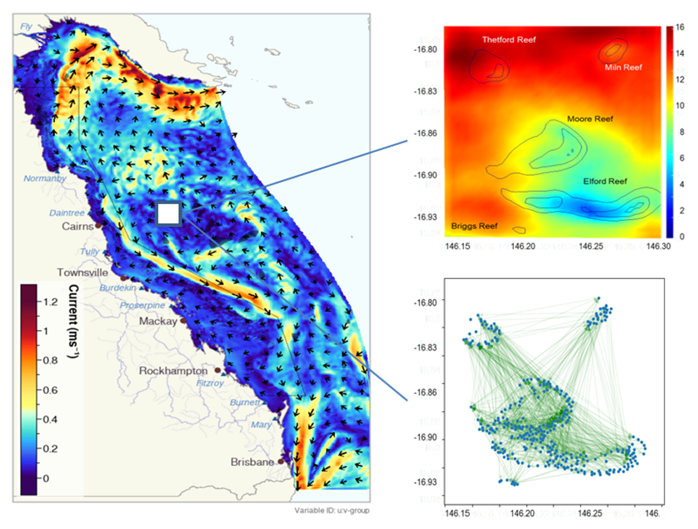
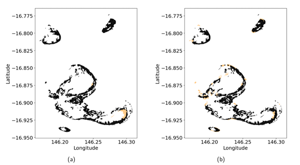

# Environmental Modelling 

{: .no_toc }

  

    Table of contents
  

{: .text-delta }
* TOC
{:toc}
____

# Common Inputs & Processes

The following environmental modelling inputs are common across all ecological models, providing the foundation for environmental forcings that inform ecological responses on the Great Barrier Reef.

To generate long-term climate change projections, eReefs and Relocatable Coastal Model (RECOM) outputs are currently combined with projected temperature trends from MIROC5 and CMIP-6 global ocean models. 

OceanParcels is used with the eReefs and RECOM output to generate larval connectivity at the cluster scale, while GBR4 & GBR1 hydrodynamic models are used to provide connectivity at the GBR-scale. Outputs from the SWAN wave model are used to provide wave stress estimates. These environmental models are combined to force ecological models at different spatial scales: 
- Site scale (~250 m),
- Reef cluster scale (<50 km)
- Regional scale across 3806 reefs in the GBR (GBR-scale)

We are working towards incorporating more integrated downscaled models that capture climate change impacts on ocean currents and eddy processes.

***Figure 1.** The spatial extent of the 4km resolution eReefs environmental model, showing simulated currents. Top right: Thermal stress (Degree Heating Weeks) from a RECOM model nested within the GBR-scale model to provide higher resolution information for the Moore Reef Cluster. Bottom right: Larval connectivity within the Moore Reef Cluster; arrows show connections where at least one larvae from the source site reached the receiving site.*

## Habitat Maps

Three types of habitat maps for the Great Barrier Reef were developed using a combination of object-based image analysis and ecological modelling, building upon a previous mapping apporach developed for the Capricorn Bunker Group area (Roelfsema et al., 2018). 
The following habitat maps were produced by Roelfsema et al. (2020):
1. Geomorphic Zonation, 
2. Benthic Cover and 
3. Coral Type.

The M&DS suite utilises the Geomorphic Zonation and Benthic Cover maps to delineate polygon boundaries and to identify suitable areas for coral restoration across the Great Barrier Reef. 

## eReefs Suite

The eReefs modelling system (Steven et al., 2019) uses the CSIRO Environmental Modelling Suite (Baird et al., 2020) to represent the 3 dimensional hydro-dynamic, sediment and biogeochemistry and ecological processes to simulate temperature, salinity and water quality across the Great Barrier Reef. 

eReefs is a platform that provides a picture of what is currently happening on the Great Barrier Reef, and what will likely happen in the future. 

**More information on eReefs:** [CSIRO website](https://research.csiro.au/ereefs/){:target="\_blank"}

### Hydro-dynamic Models (GBR4 & GBR1)

eReefs hydro-dynamic models provide information about currents and water temperature on the Great Barrier Reef in three dimensions and with 1-4 km resolution (GBR1 & GBR4). These models operate in near real time, allowing current conditions to be estimated, and hindcasts date back to 2010 (4 km grid) and 2014 (1 km grid).

ReefMod uses connectivity matrices from GBR4 to estimate particle movement and simulate regional connectivity, while CoCoNet processes connectivity matrices from GBR1 into dispersal kernels to model regional connectivity. 

### Relocatable Coastal Model (RECOM)

RECOM nests within the larger eReefs hydro-dynamic models to provide more detail at the reef cluster scale, including local-scale variations in heat stress and currents (Steven et al., 2019).

RECOM models recently delivered environmental input layers for heat stress and connectivity for business-case studies in two reef clusters in the Cairns region (Moore and Hastings) and a reef cluster in the Whitsundays region (Brick).

**More information on RECOM:** [CSIRO website](https://research.csiro.au/ereefs/models/models-about/recom/){:target="\_blank"}

## OceanParcels

 OceanParcels takes outputs from hydro-dynamic models (in this case, the eReefs and RECOM models) as input for a particle-tracking model that we use to calculate coral larval connectivity (Delandmeter & Seville, 2019) – that is, the probability that larvae released at one site will reach another site. 

OceanParcels is used to provide connectivity matrices for C~scape and ADRIAmod at the reef cluster scale. As well as providing data layers for the cluster-scale ecological models, OceanParcels has been used to identify robust source and sink locations for coral larvae within each cluster. 

**More information on OceanParcels:** [Website](https://oceanparcels.org/){:target="\_blank"}

***Figure 2.** Habitat map of reef sites. Highlighted in orange are sites that consistently act as local sources (left) and settling or destination sites (right) across all three spawning days in all three years.*

## SWAN

Simualating Waves Nearshore (SWAN) is a two-dimensional numerical model that estimates spatial wave parameters, including height, period and direction, generated by wind at 10 km spatial resolution (Callaghan et al., 2015). 

Wave exposure outputs, along with other modelled variables, are used to estimate growth and survival rates of coral groups in C~scape. 

## Climate Modelling

TThe Coupled Model Intercomparison Project (CMIP) is a global effort to improve climate change projections using a multi-model approach to climate model evaluation and experimentation. 

To forecast possible futures for the Great Barrier Reef under different climate change scenarios, the M&DS suite applies projections of Sea surface Temperatures (SST) from the sixth phase of the CMIP (CMIP-6) and considers four (4) shared socio-economic pathways (SSPs) SSP1, SSP2, SSP3, and SSP5 and five (5) emission trajectories SSP1-1.9, SSP1-2.6, SSP2-4.5, SSP3-7.0, SSP5-8.5. Note that the variety of SSPs and emissions pathways investigated vary according to the specific inquiry addressed by the M&DS suite.

The following climate models from CMIP-6 have been recently integrated into the M&DS suite after mechanistic downscaling of SST projections at 10 km resolution across the Great Barrier Reef (McWhorter et al., 2022):
- CNRM-ESM2-1
- EC-Earth3-Veg
- IPSL-CM6A-LR
- MRI-ESM2-0
- UKESM1-0-LL
- GFDL-ESM4
- MIROC-ES2L
- MPI-ESM1-2-HR
- MIROC6
- NorESM2-LM 

In addition, the following models of the previous generation (CMIP-5) have been integrated with four (4) representative concentration pathwways (RCP) scenarios (RCP2.6, RCP4.5, RCP6.0, RCP8.5) in their native spatial resolution across the Great Barrier Reef:
- CCSM4
- CESM1_WACCM
- GFDL_ESM2M
- GISS_E2_R
- HadGEM2
- MIROC5

# References

Baird, M.E., Wild-Allen, K.A., Parslow, J., Mongin, M., Robson, B., Skerratt, J., Rizwi, F., Soja-Woźniak, M., Jones, E., Herzfeld, M., & Margvelashvili, N. (2020). CSIRO Environmental Modelling Suite (EMS): scientific description of the optical and biogeochemical models (vB3p0). Geoscientific Model Development, 13(9), pp.4503-4553. https://doi.org/10.5194/gmd-13-4503-2020

Callaghan, D. P., Leon, J. X., & Saunders, M. I. (2015). Wave modelling as a proxy for seagrass ecological modelling: Comparing fetch and process-based predictions for a bay and reef lagoon. Estuarine, Coastal and Shelf Science, 153, 108–120. https://doi.org/10.1016/j.ecss.2014.12.016

Delandmeter, P., and Van Sebille, E. (2019). The Parcels v2. 0 Lagrangian framework: new field interpolation schemes. Geoscientific Model Development, 12(8), pp.3571-3584. https://doi.org/10.5194/gmd-12-3571-2019 

McWhorter, J.K., Halloran, P.R., Roff, G., Skirving, W.J., Mumby, P. (2022) Climate refugia on the Great Barrier Reef fail when global warming exceeds 3°C. Glob Change Biology. 28, pp.5768–5780.
https://doi.org/10.1111/gcb.16323 

Roelfsema, C., Kovacs, E., Ortiz, J.C., Wolff, N.H., Callaghan, D., Wettle, M., Ronan, M., Hamylton, S.M., Mumby, P.J., Phinn, S. (2018). Coral reef habitat mapping: a combination of object-based image analysis and ecological modelling. Remote Sensing of Environment. 208, pp.27–41. http://dx.doi.org/10.1016/j.rse.2018.02.005

Roelfsema, C.M., Kovacs, E.M., Ortiz, J.C., Callaghan, D.P., Hock, K., Mathieu, M., Johansen, K., Mumby, P., Wettle, M., Ronan, M., Lundgren, P., Kennedy, E.V., Phinn, S.R. (2020). Habitat maps to enhance monitoring and management of the Great Barrier Reef. Coral Reefs. 39, pp.1039–1054. https://doi.org/10.1007/s00338-020-01929-3

Steven, A.D., Baird, M.E., Brinkman, R., Car, N.J., Cox, S.J., Herzfeld, M., Hodge, J., Jones, E., King, E., Margvelashvili, N., Robillot, C., Robson, B., Schroeder, T., Skerratt, J., Tickell, S., Tuteja, N., Wild-Allen, K. and Yu, J.  (2019). eReefs: An operational information system for managing the Great Barrier Reef. Journal of Operational Oceanography, 12(sup2), pp.S12-S28. https://doi.org/10.1080/1755876X.2019.1650589 

